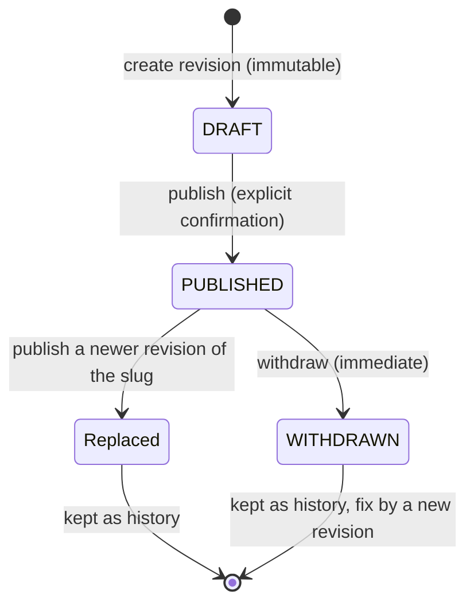
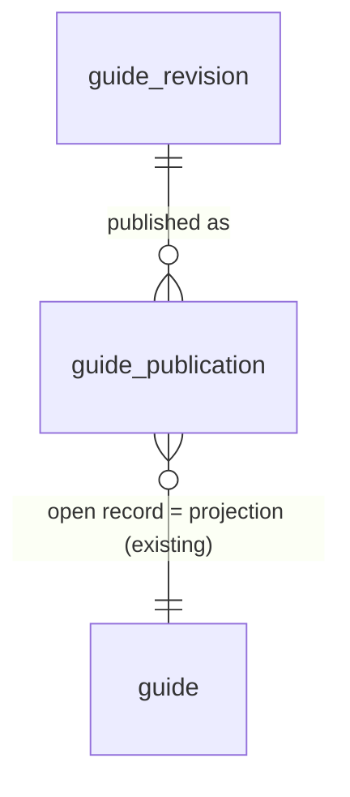

# Guide publication workflow for a solo operator: architecture (Issue #46)

> **Status: design proposal only (final revision).** Nothing described as *proposed* exists in
> this repository. This document is not legal advice, and it doesn't claim that any content
> or process meets a legal or regulatory standard.

**This revision supersedes earlier drafts of this document.** Life in UK has **one human operator**, who creates, checks, publishes, updates and withdraws Guides. The design keeps:

- `guide-content-v1` (unchanged);
- immutable content revisions with draft and published digests;
- explicit, transactional publication and withdrawal, with history;
- an editorial quality gate;
- a safe migration away from the legacy importer.

"Existing" means verified on `main` at `dfa48dd`. "Proposed" means future work.

## 1. Product boundary

- **What Life in UK is:** a small, independently operated UK living-information website. It is **not** a law firm, an immigration adviser, a legal representative or a regulated advisory service.
- **What Guides do:**
  - present accurate, source-backed public information in accessible Chinese;
  - may describe one or two clearly supported, lawful *general* pathways;
  - explain eligibility conditions, limitations, uncertainties and official sources.
- **What Guides must not do:** give personalised advice, assess an individual's case, act as a representative, guarantee outcomes, or make unsupported claims.
- **A disclaimer doesn't decide whether content is regulated advice; the substance does.** Content whose classification is uncertain is flagged for appropriate professional verification before publication (§4, §12). This design records the operator's editorial confirmation. It doesn't grant, imply or replace any legal authorisation.

## 2. Existing architecture findings

- **Storage.** One mutable `guide` row per slug (V8), with ordered `guide_source`, `guide_evidence` and `guide_evidence_support` children (V9).
  - `GuideStatus` is `DRAFT` or `PUBLISHED`. A database `CHECK` requires `DRAFT` to have a null `published_at`, and `PUBLISHED` to have `published_at ≤ updated_at`.
  - `Guide.publish(at)` needs `at ≥ updatedAt` and sets `publishedAt = updatedAt = at`.
  - Nothing keeps history.
- **The only writer is `--import-guide=<file>`.**
  - It runs `GuideImportReader` (full validation), then `GuideImporter.apply` (one transaction, row lock, `CREATED`/`UPDATED`/`UNCHANGED`).
  - The file's `status` and timestamps decide publication, so one command can publish, unpublish or overwrite a live Guide. No actor is recorded.
- **Public reads.** `GET /api/guides` and `GET /api/guides/{slug}` return only `status = PUBLISHED` rows. Unknown and draft slugs get the same 404, and there is no `Cache-Control` header. No HTTP write endpoint exists.
- **Credentials.** One datasource credential (`DB_USERNAME`, default `life_in_uk_app`) is used by Flyway, the web application and every command, so the internet-facing process could write Guides.
- **Triggers.** V2 and V3 already use PL/pgSQL triggers to protect history.
- **Digest (`GuideContentDigest`, `guide-content-v1`).**
  - SHA-256 over a fixed-order compact JSON form of a validated `GuideImportDefinition`.
  - Covers status and timestamps, so `DRAFT` and `PUBLISHED` forms have different digests.
  - Absent `evidence` gives `null` and `evidence: []` gives `[]`.
  - It isn't stored or used anywhere yet.
- **Committed artifacts.** All 10 committed artifacts in `content/guides/` are `PUBLISHED`, with `publishedAt == updatedAt` and non-empty evidence. Unpublished drafts are kept outside version control and are not referenced here.

## 3. Proposed lifecycle

There are two separate views: the **public state of a slug** (what readers see now) and the **history** (what existed and what was public when).

| View | Values | Source |
|---|---|---|
| Public state of a slug | `NOT_PUBLIC` or `PUBLISHED(revision)` | The open publication record for the slug, if any |
| Revision status (derived, never stored) | `DRAFT` (never published), `PUBLISHED` (open publication), `WITHDRAWN` (a publication of it ended by withdrawal), or previously published (ended by replacement) | `guide_publication` history |

`Replaced` isn't a state the operator manages. It is the historical end reason `REPLACED` on a publication record, kept only so the history shows which revision was public at any time. **Each revision is published at most once.** Restoring earlier wording means creating a new revision (A1) and publishing it (A2). There is no rollback command in the MVP (§11).

| # | Action | Preconditions | Effect (one transaction) |
|---|---|---|---|
| A1 | Create revision | File passes `GuideImportReader`. `status = DRAFT`, `publishedAt = null`, `evidence` present. `(slug, draft_digest)` is new. | Immutable revision stored. Nothing public changes. |
| A2 | Publish (first publication, or replacing the live revision) | Workflow activated (§8). The revision is a `DRAFT` (never published). Echoed digest = `draft_digest`. Echoed current publication matches (`--expect-current`). The automatic quality-gate checks pass. Checklist confirmed (§4). | Projection replaced from `derive(D_r, P)`. Previous open record ended `REPLACED`. New publication record. |
| A3 | Withdraw | Workflow activated. `--expect-current` matches. Reason is not blank. | Projection rows deleted (public 404 from commit). Record ended `WITHDRAWN`. |

**Forbidden:**

- editing a revision;
- publishing any revision a second time, whether it was replaced or withdrawn (see §5);
- publishing or withdrawing before activation;
- `--import-guide` writes after activation;
- a stale `--expect-digest` or `--expect-current`;
- any scheduled or background process publishing.

**Correcting a Guide** is: withdraw it now (A3), prepare a corrected revision (A1), then publish it later (A2).

## 4. Content quality gate (proposed)

`--guide-check=<revisionId>` is read-only. It prints a report, and its **blocking** checks also run inside A2.

**Automatic checks**

| Check | Blocks publish? |
|---|---|
| Stored canonical form parses with `GuideImportReader`, and re-canonicalises to the same bytes and `draft_digest` | Yes |
| `evidence` present. Non-empty for category `family-visa`. | Yes |
| No unresolved editorial markers (`[EDITORIAL`, `[EVIDENCE:`, `TODO`, `待核对`) | Yes |
| Every source is HTTPS with a non-future `accessedAt`. Every evidence link resolves (existing validation). | Yes |
| Every source is used by at least one evidence support | Yes for `family-visa`; a warning otherwise |
| Content contains a "最后更新" (last-updated) line | Warning |

**The report shows:**

- the slug, revision, `draft_digest` and the current public revision;
- a canonical diff against it;
- every source (organisation, title, URL, `accessedAt`) and every evidence statement with its supports.

**Operator confirmation.** A2 needs `--checklist=<id>` and `--verified-on=YYYY-MM-DD`. The checklist ID must match the category's checklist. The record stores the checklist ID, the confirmed date and the confirmation. Missing or uncertain sources must be fixed or removed before publication; they're never presented as verified.

**`standard-v1`** (all categories)

1. Every factual claim that needs support has evidence from an official or authoritative source, checked as at the verified-on date.
2. Eligibility conditions and limitations are stated.
3. Material uncertainty is stated, not hidden.
4. The text is general information, not advice about an individual's situation.

**`family-visa-v1`** (stricter, because mistakes cost more)

1. Rules are checked against the current official rules and guidance as at the verified-on date. The version or date of the rules checked is noted in the evidence.
2. Every eligibility condition, exception and time limit in the cited source is stated, or is explicitly placed outside the Guide's scope.
3. Every number (fees, thresholds, periods) has its own evidence.
4. Pathways are described as general options with their conditions. There is no recommendation for a particular person, no assessment of an individual case, and no guarantee or prediction of outcome.
5. Points where general information may not be enough are signposted to official sources and to appropriately regulated advisers.
6. Any uncertain item, including whether some wording could amount to regulated advice, is removed or flagged for professional verification **before** publishing.

The checklist is editorial discipline for one operator. It isn't a legal-review organisation and doesn't constitute legal approval.

## 5. Revisions and digests (proposed; `guide-content-v1` unchanged)

| Artifact | Definition | Digest |
|---|---|---|
| Draft revision `D_r` | `status = DRAFT`, `publishedAt = null`, `updatedAt = T_r`, evidence present | `draft_digest = v1(D_r)` |
| Published form `D_p` | `derive(D_r, P)`: identical to `D_r` except `status = PUBLISHED` and `publishedAt = updatedAt = P` | `published_digest = v1(D_p)` |

- **Derivation.** `derive` mirrors `Guide.publish(at)`: it needs `P ≥ T_r`, and `P` is the server clock truncated to whole seconds.
- **Everything else is identical,** including evidence presence (`null` versus `[]`). Comparisons always pair draft digest with draft digest, or published digest with published digest.
- **Content is stored once,** as `canonical_form`, the exact v1 text. Java (`GuideContentDigest`) computes both digests.
- **A database trigger re-checks the stored text.** At insert it verifies that `draft_digest` equals SHA-256 of the stored text and that the status is `DRAFT`. This catches a corrupted or hand-made row.
- **Identity.** A revision is identified by its UUID. `revision_number` (per slug) is for people to read. `(slug, draft_digest)` is unique, so identical content returns the existing revision (`EXISTING`, with its status). A revision that has been published can't be published again. A corrected Guide has different content or a new `updatedAt`, so it gets a new digest and a new revision.
- **Provenance.** The revision itself is the source and evidence snapshot. `accessedAt` remains the consultation time.

## 6. Proposed data model

Three small new tables. The existing `guide` tables become the **public projection**: they hold live content only and are written only by the publication service once the workflow is active.

| Table | Columns | Rules |
|---|---|---|
| `guide_revision` | `id uuid PK`, `slug`, `revision_number`, `canonical_form text`, `draft_digest char(64)`, `based_on_revision_id NULL`, `created_at`, `created_by`, `db_session_user DEFAULT session_user`, `ai_assisted bool`, `note NULL` | `UNIQUE (slug, draft_digest)`, `UNIQUE (slug, revision_number)`. Trigger: insert digest check; no `UPDATE`/`DELETE`. |
| `guide_publication` | `id uuid PK`, `slug`, `revision_id FK`, `published_at`, `published_digest char(64)`, `published_by`, `db_session_user DEFAULT session_user`, `checklist_id`, `verified_on date`, `legacy bool`, `ended_at NULL`, `end_reason NULL` (`REPLACED`/`WITHDRAWN`), `ended_by NULL`, `end_note NULL` | Partial unique index: one open record per slug (`ended_at IS NULL`). `CHECK`: end columns all null or all set, and `WITHDRAWN` needs `end_note`. `CHECK`: `legacy` rows have `checklist_id = 'legacy-baseline'` and a null `verified_on`; all other rows have a real checklist and date. Trigger: identity columns immutable, end columns written once, no `DELETE`. |
| `guide_workflow_activation` | Single row: `activated_at`, `activated_by` | Created empty with `guide_publication` (Issue 2). Inserted once by `--guide-activate` (§8). |

`guide_revision` and `guide_publication` are the audit history: who created, published, replaced and withdrew which exact content, when, and from which database session. Failed attempts are logged by the application, not stored.

**Java services (proposed)**

- **`GuideRevisionService`:** creates revisions (A1) and runs the `--guide-check` report.
- **`GuidePublicationService`:** runs A2 and A3, each in one transaction.
  1. Take `pg_advisory_xact_lock` on the slug.
  2. Check activation, digests, `--expect-current` and the quality gate.
  3. Write the projection by **reusing `GuideImporter.apply(D_p)`**.
  4. Write the publication records.
  5. Set the write-guard flag (§8) before the projection write.
- **`GuideIntegrityCheck`:** read-only `--guide-verify`.
- **`GuideActivation`:** `--guide-baseline` and `--guide-activate` (§8).

All business logic is in Java. Triggers only protect immutability and the activation guard.

## 7. Commands, authentication and trust boundary (proposed)

| Command | Effect |
|---|---|
| `--guide-revision-create=<file> [--based-on=<id>] [--ai-assisted]` | A1. Prints `CREATED <id> <draftDigest>` or `EXISTING <id> <status>`. |
| `--guide-check=<revisionId>` | Quality-gate report. Read-only. |
| `--guide-publish=<revisionId> --expect-digest=<draftDigest> --expect-current=<publicationId\|none> --checklist=<id> --verified-on=<date>` | A2. Prints `PUBLISHED <publicationId> <publishedDigest>`. If the revision is already the live one, prints `ALREADY_PUBLISHED` with no writes. Any other non-`DRAFT` revision is refused. |
| `--guide-withdraw=<slug> --expect-current=<publicationId> --reason=<text>` | A3 |
| `--guide-baseline=<committed artifact>` | Legacy baseline (§8) |
| `--guide-activate` | Activation (§8) |
| `--guide-verify` | Integrity report. Nonzero exit on any mismatch. |

**Authentication (recommended MVP)**

- **Two database credentials.**
  - **Runtime credential:** the web application gets one that can only `SELECT` Guide tables (plus its existing acquisition-table rights).
  - **Admin credential:** a separate one owns the schema and runs Flyway and all `--guide-*` commands. It is held only by the operator, in a password manager, and supplied only when running a command.
- **Network access** to the database is restricted (TLS plus an IP allowlist or SSH tunnel; D-4).
- **Attribution, not authentication.** Commands record `created_by`/`published_by`/`ended_by` from a required `LIFE_IN_UK_OPERATOR` setting, plus `session_user`.

**Trust boundary (stated honestly)**

- **Anyone holding the admin credential can do anything:** run `psql`, disable triggers, or edit rows. The database doesn't prevent deliberate action by that person. Possession of the admin credential *is* the operator's authentication.
- **The design protects against accidents and lower-privileged compromise:**
  - stale or mismatched versions, through digest and current-publication checks;
  - the legacy importer or old binaries, through the activation guard;
  - a compromised web process, which has no write rights to Guide tables;
  - silent history changes, through immutability triggers.
- **AI:**
  - AI may draft, research and run `--guide-check`.
  - Software can't tell a human from an AI agent using the same credential. So **AI agent sessions must never have the admin credential**, and agent permission rules should deny `--guide-publish` and `--guide-withdraw`.
  - Publish and withdraw are run by the operator personally.
- **No scheduled or background process publishes.** Any future scheduled job is read-only (§11).
- **OIDC is out of the MVP.** An admin UI would later add an authenticated HTTP layer over the same services (§11).

**Feasibility with the current configuration**

- **Credential split (Issue 4).**
  - Spring Boot's standard `spring.flyway.user`/`spring.flyway.password` let Flyway use the admin credential while `spring.datasource.*` uses the runtime one. No new dependency is needed.
  - The existing schema objects are currently owned by the single application role, so a one-time database-administrator step transfers ownership to the admin role (`REASSIGN OWNED` or `ALTER … OWNER`).
  - A migration then grants the runtime role exactly what it uses: `SELECT` on Guide tables, and the existing acquisition and source-configuration writes that the startup bootstrap runners need. The role name comes from a Flyway placeholder.
  - Admin commands run the same jar with the admin datasource credential.
- **Write guard (Issue 3).**
  - `GuidePublicationService` calls `set_config('life_in_uk.guide_publication', 'on', true)` inside its `@Transactional` method, before `GuideImporter.apply`. The setting is scoped to the transaction, so it can't leak to other pooled connections.
  - The trigger is a few lines of PL/pgSQL, like the V2/V3 triggers, and is inactive until the activation row exists. Existing tests and unactivated databases are unaffected.

## 8. Legacy importer migration and activation (proposed)

**Activation is per database and explicit.** Until it happens, the workflow is **not active**: publish and withdraw refuse, and `--import-guide` behaves as today. After it, `--import-guide` refuses and only the workflow writes. Both are never true at once, so there is no mixed mode.

**Steps (production)**

1. **Deploy the release.**
   - It adds the tables and a **write-guard trigger** on `guide`, `guide_source`, `guide_evidence` and `guide_evidence_support`.
   - Once an activation row exists, the trigger rejects any `INSERT`/`UPDATE`/`DELETE` unless `current_setting('life_in_uk.guide_publication', true) = 'on'`. Only `GuidePublicationService` sets that flag, with `SET LOCAL`, inside its transaction.
   - The release also makes `--import-guide` refuse whenever an activation row exists.
2. **Baseline every live Guide.** Run `--guide-baseline=content/guides/<slug>-zh.json` for each committed artifact.
   - The artifact is validated, and must match the live projection exactly (the importer's `UNCHANGED` comparison) and satisfy `publishedAt == updatedAt`. All 10 current artifacts do.
   - Its `D_r` (status `DRAFT`, `publishedAt = null`, same `updatedAt`) is stored as a revision.
   - An open `legacy = true` publication is stored, with `P = publishedAt`, `published_digest = v1(artifact)` and checklist `legacy-baseline`. This marks content published before the quality gate existed; it is not a checklist confirmation. The projection is not touched, and nothing public changes.
3. **Activate.** `--guide-activate` runs in one transaction. It refuses if:
   - any `DRAFT` row exists in `guide` (drafts must not become managed implicitly); or
   - any `PUBLISHED` row lacks an open baseline whose digest matches the live content (catching changes made between steps 2 and 3).

   Otherwise it inserts the activation row.
4. **Run `--guide-verify`.**

**After activation**

- Existing Guides stay live unchanged.
- Every update goes through A1→A2.
- An old jar or a manual `--import-guide` fails at the trigger, which guards against accidents. A deliberate `psql` session as admin is outside the guarantee, as stated in §7.

**Local development and tests**

- A development database can stay unactivated, keeping `--import-guide` for convenience. Tests activate isolated databases as needed.
- Production readiness is shown by `--guide-verify`, which reports the activation status.

**Family & Visa drafts stay private**

- They're never committed. Adding `content/drafts/` to `.gitignore` is recommended (D-5).
- They aren't stored in the database until the operator creates a revision.
- Revisions are never readable through any public endpoint, and with the credential split the runtime role can't `SELECT` them at all.
- The frontend's local preview keeps reading local files, unchanged.

## 9. Security invariants and failure scenarios (proposed)

| ID | Invariant |
|---|---|
| S-1 | Public endpoints read only the projection, which holds only content from an open publication record. No public endpoint reads revisions, and there are no public write endpoints. |
| S-2 | Revision content and publication identity can't be updated or deleted. Publication end columns are written once. |
| S-3 | Publish needs the echoed `draft_digest`, re-verified from the stored text, and a matching `--expect-current`, under the slug lock. |
| S-4 | `published_digest = v1(derive(D_r, P))`, and the projection equals `D_p`. `--guide-verify` re-checks this. |
| S-5 | At most one open publication per slug. Each revision is published at most once, so neither replaced nor withdrawn content can be republished, and identical content can't be resubmitted as a new revision. |
| S-6 | After activation, only `GuidePublicationService` can write the projection without tripping the guard trigger, and `--import-guide` refuses. Before activation, publish and withdraw refuse. |
| S-7 | Publish needs the blocking quality-gate checks and an explicit checklist confirmation. No background job publishes. |
| S-8 | The web application's credential can't write Guide tables (after the credential split). |
| S-9 | Withdrawal returns 404 from commit, and Guide responses carry `Cache-Control: no-store`. |

| Scenario | Outcome |
|---|---|
| Content edited after the operator checked it | A new revision with a new digest. Publish with the old digest is refused (S-3). |
| Publish based on an outdated view of the live version | `--expect-current` mismatch, refused (S-3) |
| Legacy importer or old jar run after activation | Guard trigger rejects (S-6) |
| Importer changes a live Guide between baseline and activation | Activation refuses on digest mismatch (§8) |
| Wrong content discovered live | `--guide-withdraw` then 404 at commit. Fix through a new revision. |
| Withdrawn content accidentally republished | Refused (S-5) |
| AI agent tries to publish | Agent has no admin credential, and permission rules deny the command (§7). If an agent were given the credential, nothing technical could stop it; that's a documented boundary. |
| Web application compromised | No write rights to Guide tables (S-8) |
| Admin credential leaked | Full control for the holder; outside the design's guarantees. Mitigated by credential custody and network restriction. Rotate it. |
| Crash mid-publish | Transaction rolls back and the earlier version stays live. A retry gives `ALREADY_PUBLISHED` or a stale error. |

## 10. Testing strategy (proposed)

All tests use the isolated temporary PostgreSQL and synthetic fixtures, with no network.

- **Revisions:** immutability (the trigger rejects `UPDATE`/`DELETE`); digest check at insert; `EXISTING` for identical content; evidence-presence rule.
- **Digests:** `derive` matches `Guide.publish` semantics; `null` versus `[]` evidence is kept; fixed-hash fixtures for `D_r` and `D_p`, computed independently as in Issue #44.
- **Publication:**
  - stale `--expect-digest` and stale `--expect-current` are refused, with nothing changed;
  - replacement ends the previous record as `REPLACED` in the same transaction;
  - publishing a replaced or withdrawn revision is refused;
  - `ALREADY_PUBLISHED` idempotency;
  - a forced failure part-way leaves the old version live;
  - two concurrent publishes: one wins.
- **Quality gate:** each blocking check refuses publish. The checklist ID must match the category (`family-visa-v1` for `family-visa`).
- **Activation:**
  - before activation, publish and withdraw refuse;
  - baseline refuses on any mismatch with the live row;
  - activation refuses on `DRAFT` rows or a missing or mismatched baseline;
  - after activation, `--import-guide` and direct repository writes fail, and public responses are byte-identical to before.
- **Public API:** revisions are never visible; withdrawal returns 404; `no-store` is present; contracts are otherwise unchanged.
- **Credentials:** connected as the runtime role, writes to Guide tables and `SELECT` on revisions are denied.
- **Verify:** `--guide-verify` passes on a clean database and fails on each kind of injected drift.

## 11. Implementation roadmap (proposed Issues, not created)

**MVP (required, in order)**

| # | Issue | Scope | Acceptance |
|---|---|---|---|
| 1 | Immutable Guide revisions and quality-gate check | `guide_revision` with triggers; `GuideRevisionService`; `--guide-revision-create`; `--guide-check` with both checklists. No public effect. | Revision and digest tests (§10). Check report covers §4. |
| 2 | Transactional publish and withdraw (inactive until activation) | `guide_publication` and an empty `guide_workflow_activation`; `GuidePublicationService` reusing `GuideImporter.apply`; `--guide-publish`, `--guide-withdraw`; `Cache-Control: no-store`. Both commands refuse without an activation row; tests activate isolated databases. | Publication and public-API tests. |
| 3 | Legacy baseline, write guard and activation | Write-guard trigger; `--import-guide` refusal; `--guide-baseline`, `--guide-activate`, `--guide-verify`; production runbook. | Activation tests. Byte-identical public responses. Old-importer rejection. |
| 4 | Runtime/admin credential separation | Separate Flyway/admin credential (`spring.flyway.user`); runtime role `SELECT`-only on Guide and revision tables, keeping existing acquisition rights; deployment runbook. | Credential tests. All existing tests pass under split roles. Required before the first Family & Visa publication. |

**Optional, later**

- **Admin UI:** an authenticated HTTP layer and frontend screens over the same services, showing the digest and checklist before publishing.
- **Rollback command:** republish an earlier replaced revision directly. This is out of scope for the MVP, where a new revision is created instead.
- **Monitoring and scheduled re-verification:** read-only scheduled `--guide-verify`, and reminders when `verified_on` is old (for example, re-check Family & Visa Guides after official rule changes). Never publishes.

## 12. Open decisions (human, product or legal boundary)

| ID | Decision | Recommendation |
|---|---|---|
| D-1 | Where the line falls between general information and regulated immigration advice for specific Family & Visa content, and which items need professional verification before launch | Needs appropriate professional input. Until resolved, uncertain items are left out of published content (`family-visa-v1` item 6). |
| D-2 | Final wording of `standard-v1` and `family-visa-v1`, and the re-verification interval for Family & Visa | Adopt §4 as a starting point. Re-check after every relevant official rule change, and at least every 3–6 months. |
| D-3 | Withdrawal deletes projection rows rather than setting `DRAFT` | Delete. History is in the two tables. |
| D-4 | Admin credential custody and database network access (TLS, IP allowlist or SSH tunnel) for the actual hosting | Confirm before Issue 4 |
| D-5 | Add `content/drafts/` to `.gitignore` so drafts can't be committed accidentally | Yes, as a separate small change |
