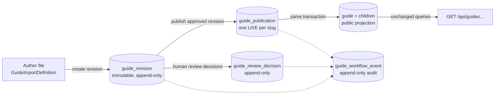
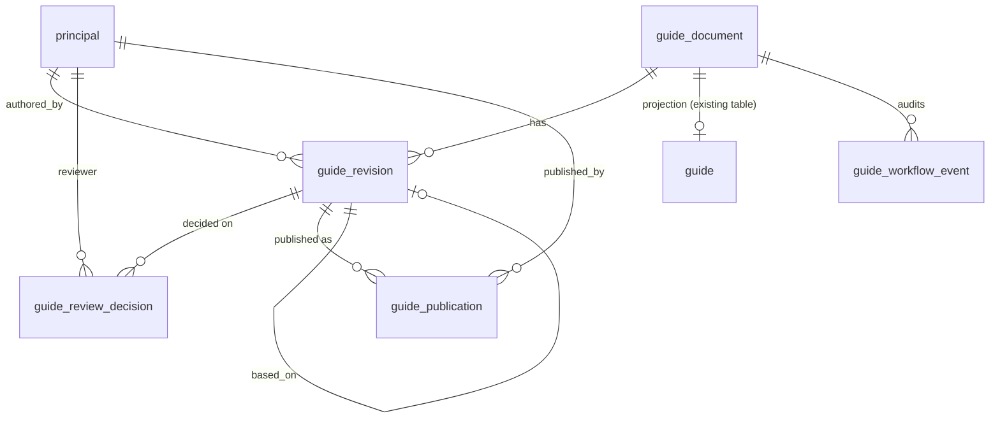

# Guide legal review and publication workflow: architecture (Issue #46)

> **Status: design proposal only.** Nothing in this document is implemented. No state,
> table, command, endpoint, role or index described as *proposed* exists in this
> repository. It is not legal advice, and it does not claim that any workflow meets a
> legal or regulatory standard. Those judgements need qualified human review.

**Legend.** Each section marks its content as one of two kinds:

- **Existing:** verified against the code on `main` at `dfa48dd`.
- **Proposed:** design for future Issues. It does not exist yet.

## Contents

1. [Existing architecture findings](#1-existing-architecture-findings)
2. [Proposed architecture and rationale](#2-proposed-architecture-and-rationale)
3. [Lifecycle state transition table](#3-lifecycle-state-transition-table)
4. [Roles and permissions matrix](#4-roles-and-permissions-matrix)
5. [Digest and versioning strategy](#5-digest-and-versioning-strategy)
6. [Proposed data model and API boundaries](#6-proposed-data-model-and-api-boundaries)
7. [Publication and withdrawal sequences](#7-publication-and-withdrawal-sequences)
8. [Security invariants and failure scenarios](#8-security-invariants-and-failure-scenarios)
9. [Testing strategy](#9-testing-strategy)
10. [Phased implementation roadmap](#10-phased-implementation-roadmap)
11. [Open decisions requiring human approval](#11-open-decisions-requiring-human-approval)

---

## 1. Existing architecture findings

All of this section describes **existing** behaviour.

### 1.1 Storage model

- **One mutable aggregate per slug.**
  - The `guide` table (V8) has a UUID `id` and a `UNIQUE` `slug`, plus category, title, summary, Markdown content, `status`, `published_at` and `updated_at`.
  - It has owned children: `guide_source` (V8, plus a nullable `editorial_key` added in V9), `guide_evidence` (V9) and `guide_evidence_support` (V9). Each child has explicit order columns and composite foreign keys, so a support can only reference a keyed source of the same Guide.
- **No history.** An import overwrites the row in place, and changed source and evidence rows are deleted and reinserted. Earlier versions, their sources and their evidence are not kept anywhere in the database.
- **Publication state is two values.**
  - `GuideStatus` is `DRAFT` or `PUBLISHED`.
  - A database `CHECK` and `Guide.validatePublication` enforce the same rule: `DRAFT` has a null `published_at`, and `PUBLISHED` needs `published_at ≤ updated_at`.
  - `Guide.publish(at)` needs a `DRAFT` and `at ≥ updatedAt`, then sets `publishedAt = updatedAt = at`.
  - There is no workflow state and no record of who did anything.

### 1.2 Write path

- **`--import-guide=<path>` (`GuideImportCommand`) is the only writer.**
  - It runs only when that literal command-line option is present.
  - `GuideImportReader` validates the whole file before any transaction opens. It rejects unknown and duplicate fields, uses strict timestamp formats, and checks every evidence reference through `GuideImportDefinition` and `GuideEvidenceReferences`.
- **`GuideImporter.apply` runs in one transaction.**
  - It locks an existing row (`PESSIMISTIC_WRITE` on `findBySlug`) and upserts by slug.
  - It returns `CREATED`, `UPDATED` or `UNCHANGED`. An identical replay changes no rows.
- **The file decides publication.**
  - `status`, `publishedAt` and `updatedAt` come straight from the file, so the importer can create a `DRAFT`, publish, or return a published Guide to `DRAFT`. The last case is covered by `draftPublishedAndExplicitReturnToDraftUseUnchangedPublicApiSemantics`.
  - Nothing records who imported or why. Anyone with the database credentials and the jar can publish.
- **Absent versus empty evidence.**
  - For an existing Guide that already has evidence, an absent `evidence` collection is rejected and `evidence: []` deletes the evidence.
  - For a new Guide, or one without evidence, the two give the same stored rows.
- **No HTTP writes.** No write endpoint exists (`noPublicWriteMethodsExist`), and there is no Spring Security, user model or role model.

### 1.3 Read path

- `GET /api/guides` and `GET /api/guides/{slug}` (`GuideController` → `GuideQuery` → `GuideRepository`) query only `status = PUBLISHED`.
- Unknown and unpublished slugs return the same 404, `GUIDE_NOT_FOUND`.
- Detail reads use a `REPEATABLE_READ` read-only transaction. Responses never include internal IDs.
- **Draft rows share the table that public reads use.** Keeping them hidden depends entirely on the `status` filter in two queries.
- **The Guide endpoints set no `Cache-Control` header.** `PlacesController` uses `no-store`, but the Guide endpoints don't, so an intermediary could keep withdrawn content.

### 1.4 Content digest (Issue #44, `GuideContentDigest`)

- **Input:** a SHA-256 hex digest using canonicalization `guide-content-v1`, computed from a validated `GuideImportDefinition`. It never uses raw bytes or database rows.
- **Covers:** slug, category, title, summary, content, **status**, **publishedAt**, **updatedAt**, ordered sources and ordered evidence with supports.
- **Absent `evidence` → `null` and `evidence: []` → `[]`,** so the two give different digests.
- **Moving `DRAFT` to `PUBLISHED` changes the digest,** because status and timestamps are covered.
- **Not used anywhere yet.** It isn't persisted, exposed or wired into the importer.
- **Can't be recomputed from stored rows alone.** The stored aggregate can't tell absent evidence from `[]` when there is no evidence.

### 1.5 Content in version control

- Published artifacts live in `content/guides/<slug>-zh.json`. `ProductionGuideArtifactsTest` validates every one with the production reader and checks that slugs are unique.
- Unpublished drafts are kept outside version control. This document doesn't reference or reproduce any of them.

### 1.6 Gaps this design closes

| Gap (existing) | Consequence |
|---|---|
| No immutable versions | Approval can't be tied to exact content, and nothing shows what was approved |
| No actor identity | Approval and publication can't be attributed to a person |
| Importer can publish directly | Unreviewed wording can go live with one command |
| Drafts share the public table | Draft secrecy depends on one query filter |
| No withdrawal record | Returning to `DRAFT` is silent, and a later import can republish by accident |
| No cache policy on Guide reads | Withdrawn content can persist downstream |
| Digest not bound to anything | Nothing yet guarantees the approved version equals the live version |

---

## 2. Proposed architecture and rationale

**Everything in this section is proposed.**

### 2.1 Core idea: three layers, one writer per layer



1. **Revisions** are immutable snapshots of a validated import definition, identified by a UUID and a `guide-content-v1` **review digest**. Editing always creates a new revision. Nothing edits one in place.
2. **Review decisions** are append-only records that a named human made a decision about one revision and one digest.
3. **Publications** record that an approved revision went live at a time, with its own **published digest**. The existing `guide` table becomes a **projection** that holds only live content and is written only by the publication service.

### 2.2 Why this shape

- **Approval can't move to other content.** It references a revision ID and that revision's digest, and revisions can't change, so editing produces a new revision with no approval.
- **The public read path doesn't change.**
  - Public queries keep reading `guide WHERE status = PUBLISHED`.
  - Drafts move out of the `guide` table into revision tables that the runtime role can't read (§8, I-3). The status filter stays as a second safeguard.
- **Two kinds of state are kept apart.** Editorial review state belongs to a revision. Public publication state belongs to a slug. A revision can be approved and never published, and a published revision can later be superseded or withdrawn without rewriting its review history.
- **It reuses what exists.**
  - The reader and validation produce revisions.
  - `GuideImporter.apply` writes the projection inside the publication transaction.
  - The `Guide.publish(at)` rule gives the published-definition derivation (§5).
  - Isolated-Postgres tests cover all of it.
- **Minimal infrastructure.** PostgreSQL constraints, two small triggers and command-line operations are enough for the first phases. An authenticated HTTP admin API and UI come later, on top of the same service layer.

### 2.3 What deliberately does not change

- **Public API:** the `GET /api/guides` and `GET /api/guides/{slug}` response contracts stay the same.
- **Digest:** `guide-content-v1` is unchanged. This design adds no new canonicalization (see §11, D-9).
- **Migration:** existing published Guides keep serving during and after it (§6.6).

---

## 3. Lifecycle state transition table

**All states in this section are proposed.** They are not values of the existing `GuideStatus` enum, which stays as the projection's `DRAFT`/`PUBLISHED`.

The seven lifecycle states fall into two separate state machines.

| Kind | States | Belongs to |
|---|---|---|
| Review state | `DRAFT`, `IN_REVIEW`, `CHANGES_REQUESTED`, `APPROVED` | a revision |
| Publication state | `PUBLISHED`, `SUPERSEDED`, `WITHDRAWN` | a publication record |

A revision's overall lifecycle is its review state until it is first published, then the state of its latest publication.

```mermaid
stateDiagram-v2
    [*] --> DRAFT: author creates revision
    DRAFT --> IN_REVIEW: author submits (digest echoed)
    IN_REVIEW --> DRAFT: author retracts
    IN_REVIEW --> CHANGES_REQUESTED: reviewer requests changes
    IN_REVIEW --> APPROVED: human reviewer approves (digest echoed)
    APPROVED --> CHANGES_REQUESTED: reviewer revokes approval (before publication)
    APPROVED --> PUBLISHED: publisher publishes
    PUBLISHED --> SUPERSEDED: another revision of the slug is published
    PUBLISHED --> WITHDRAWN: publisher/admin withdraws
    SUPERSEDED --> PUBLISHED: explicit rollback (approval still valid)
    SUPERSEDED --> WITHDRAWN: retire from rollback eligibility
    CHANGES_REQUESTED --> [*]: terminal for this revision; author creates a new revision
    WITHDRAWN --> [*]: terminal; never republished
```



### 3.1 Allowed transitions

| # | From | To | Actor | Preconditions (all must hold) | Side effects |
|---|---|---|---|---|---|
| T1 | (none) | `DRAFT` | Author (human) | File passes `GuideImportReader`. `status=DRAFT`, `publishedAt=null`, `evidence` present (D-10). No revision of the slug already has this digest (I-11). | Store the canonical form and review digest. Audit `REVISION_CREATED`. |
| T2 | `DRAFT` | `IN_REVIEW` | Author | Echoed digest equals the stored review digest. No other revision of the slug is `IN_REVIEW`. | Audit `REVIEW_SUBMITTED`. |
| T3 | `IN_REVIEW` | `DRAFT` | Author | Echoed digest matches. | Audit `REVIEW_RETRACTED`. |
| T4 | `IN_REVIEW` | `CHANGES_REQUESTED` | Reviewer | Reviewer is human, holds the reviewer role, and is not the author. Reason is not blank. | Append a decision. Audit `CHANGES_REQUESTED`. |
| T5 | `IN_REVIEW` | `APPROVED` | Reviewer | Reviewer is human, holds the reviewer role, and is not the revision author (I-6). The echoed digest equals the stored digest, which is recomputed from the stored canonical form. A review reference and scope are recorded. | Append an `APPROVED` decision with its expiry (D-3). Audit `APPROVED`. |
| T6 | `APPROVED` | `CHANGES_REQUESTED` | Reviewer (any qualified reviewer) | Revision never published. Reason is not blank. | Append a `REVOKED` decision. Audit `APPROVAL_REVOKED`. |
| T7 | `APPROVED` | `PUBLISHED` | Publisher | See §7.1: all of I-1 to I-10. | Projection replaced. The previous publication becomes `SUPERSEDED`. Audit `PUBLISHED`. |
| T8 | `PUBLISHED` | `SUPERSEDED` | System, inside T7 or T9 | Another revision of the same slug became live in the same transaction. | Audit `SUPERSEDED`. |
| T9 | `SUPERSEDED` | `PUBLISHED` | Publisher (explicit rollback command) | Approval not revoked and not expired. Revision never withdrawn. The expected current live publication matches. | As T7, recorded as `ROLLED_BACK`. |
| T10 | `PUBLISHED` | `WITHDRAWN` | Publisher, or Admin in an emergency | The expected live publication matches. Reason is not blank. | Projection removed (D-6). Audit `WITHDRAWN`. |
| T11 | `SUPERSEDED` | `WITHDRAWN` | Publisher or Reviewer | Reason is not blank. | Rollback to this revision is no longer possible. Audit `WITHDRAWN`. |

### 3.2 Forbidden transitions (enforced, not just undocumented)

| Attempt | Why forbidden | Enforcement (proposed) |
|---|---|---|
| Editing a revision in any state | Approval would apply to content nobody reviewed | Immutable columns. The trigger rejects `UPDATE` and `DELETE` (I-2). |
| `DRAFT`/`IN_REVIEW`/`CHANGES_REQUESTED` → `PUBLISHED` | Unapproved wording would go live | The publish service needs a valid `APPROVED` decision (I-1). |
| `CHANGES_REQUESTED` → `APPROVED` or `IN_REVIEW` | Changes mean new content, so a new revision | State machine. Terminal state. |
| `WITHDRAWN` → anything | Prevents accidental republication | Terminal state. The publish service rejects it (I-11). |
| Approval by the author, an AI or a service principal | Separation of duties; AI can't approve | Constraint so the reviewer must be human (I-5), plus a service check that reviewer ≠ author (I-6) |
| Approving a stale digest (the echo differs from the stored one) | The reviewer saw different content | Compare-and-set on the digest (I-4) |
| Publishing with a `--import-guide` file once the workflow is on | Bypasses review | Importer guard (§6.6, I-12) |
| Two revisions of one slug `IN_REVIEW` at once | Competing reviews of competing content | Partial unique index |

### 3.3 Content changes during review

- **Revisions never change.** "Changing content during review" always means creating a new revision.
- **Only one open review per slug.** The author first retracts the old one (T3), or gets changes requested (T4), then submits the new revision.
- **Approvals never carry over.** The new revision starts at `DRAFT` with no approval. `based_on_revision_id` records where it came from, for diffing.
- **Re-review support (proposed).** The service can produce a canonical-form diff between a revision and the one it is based on, to help the reviewer. The approval still covers the whole new revision.

### 3.4 How approval becomes invalid

- **Approval binds to `(revision_id, review_digest)`, and the revision can't change.** So approved content can't change without becoming a different revision. Approval then fails for that new revision because it has no `APPROVED` decision.
- **Approval also stops counting when:**
  - it is revoked (T6);
  - it reaches its expiry (D-3), which is checked at publish and rollback time;
  - the stored canonical form no longer hashes to the approved digest, which would be tampering, so the publish fails and an alert is raised (I-4).

### 3.5 Competing edits and concurrent publication

- **Competing edits** become separate revisions. The open-review index lets only one be reviewed at a time.
- **Stale base (publishing over a newer live version).**
  - Every publish sends the ID of the publication it expects to replace, or `none`.
  - The service locks the slug's `guide_document` row (`SELECT … FOR UPDATE`) and compares. If they differ it rejects with `STALE_LIVE_VERSION`, so nobody silently overwrites content published after they reviewed.
- **Concurrent publishes of the same slug** queue on the same lock.
  - The second one sees that its expected live publication is out of date and fails.
  - A partial unique index allows only one `LIVE` publication per slug, as a backstop.
- **First publication of a new slug.** The `guide_document` row is created with the first revision, so there's always a row to lock and no race between two first publications.

### 3.6 Withdrawal and replacement

- **Replacement** means publishing a newer approved revision (T7). The old publication becomes `SUPERSEDED` in the same transaction, so the public never sees a gap or a mix of versions.
- **Withdrawal** (T10) removes the slug from public reads at once and permanently retires that revision.
- **After a withdrawal,** the slug can go live again only by publishing a different, newly approved revision. Content identical to the withdrawn revision can't even be resubmitted, because `(slug, review_digest)` is unique (I-11). A corrected or re-dated revision has a new digest and needs a full new review.

---

## 4. Roles and permissions matrix

**All roles here are proposed.** No role or user model exists today.

**Principals.** Each principal has a `kind`: `HUMAN`, `SERVICE` or `AI`.

- Only `HUMAN` principals can hold any role, including Author. The `AI` and `SERVICE` kinds exist so tooling can be recorded and refused, not so it can act.
- AI tools may help with research, drafting and consistency checks. Their output enters the workflow only when a human Author creates a revision from it. That human is the recorded author and is responsible for it. AI is never recorded as author, reviewer or publisher (I-5). Whether to also flag AI-assisted revisions is part of D-11.

| Action | Author / editor | Legal reviewer (qualified human) | Publisher / approver | Administrator | AI / service |
|---|:-:|:-:|:-:|:-:|:-:|
| Create revision (T1) | ✅ | ❌ | ❌ | ❌ | ❌ output enters only through a human Author |
| Submit or retract own revision (T2, T3) | ✅ own revisions only | ❌ | ❌ | ❌ | ❌ |
| Read revisions and diffs (admin path only) | ✅ | ✅ | ✅ | ✅ | ❌ given material only through a human Author (D-11) |
| Request changes (T4) | ❌ | ✅ | ❌ | ❌ | ❌ |
| Approve (T5) | ❌ | ✅ not on own revision | ❌ | ❌ | ❌ never |
| Revoke approval (T6) | ❌ | ✅ | ❌ | ❌ | ❌ |
| Publish or roll back (T7, T9) | ❌ | ❌ by default, see D-1 | ✅ not on own revision | ❌ | ❌ |
| Withdraw (T10, T11) | ❌ | ✅ T11 only | ✅ | ✅ emergency T10 only, reason required | ❌ |
| Manage principals and roles | ❌ | ❌ | ❌ | ✅ can't grant own roles (D-12) | ❌ |
| Read audit log | ✅ own slugs | ✅ | ✅ | ✅ | ❌ |
| Change or delete audit, revision or decision rows | ❌ | ❌ | ❌ | ❌ blocked by triggers (I-2) | ❌ |

**Separation of duties**

- **Author ≠ reviewer for the same revision.** Mandatory (I-6).
- **Author ≠ publisher.** Mandatory.
- **Reviewer ≠ publisher.** Recommended as mandatory for any category that needs legal review. This is open decision D-1, because a very small team may not have two qualified people.
- **Administrator** can't approve or publish unless the person also holds that role. Holding Administrator is never enough. Emergency withdrawal is allowed because it only reduces what's public.
- **Every approval names a human.** It records the reviewer principal and their qualification reference (§6.2), which an administrator records when granting the role.

---

## 5. Digest and versioning strategy

**`guide-content-v1` exists and is unchanged.** How this section uses it is proposed.

### 5.1 Two definitions, two digests

The digest covers status and timestamps, so one digest can't represent both the reviewed content and the published content. The design keeps two related artifacts.

| Artifact | Definition | Digest |
|---|---|---|
| **Review artifact** (a revision) | `D_r`: the validated definition as submitted, with `status = DRAFT`, `publishedAt = null`, `updatedAt = T_r` (the author's content time) and `evidence` present | `review_digest = v1(D_r)` |
| **Published artifact** (a publication) | `D_p = derive(D_r, P)`: identical to `D_r` field by field, except `status = PUBLISHED`, `publishedAt = P`, `updatedAt = P` | `published_digest = v1(D_p)` |

**Derivation rule.**

- `derive` mirrors the existing `Guide.publish(at)` exactly: it needs `P ≥ T_r` and sets `publishedAt = updatedAt = P`.
- `P` comes from the database clock (`now()`), truncated to microseconds to fit v1's precision limit. Users can't supply it.
- `D_r` and `D_p` are identical in every other field: same text, same source and evidence order, and the same evidence-collection presence (the `null` versus `[]` distinction carries over unchanged).

**Verification.** Anyone can check a publication from the stored data:

```
v1(D_r_stored)              == revision.review_digest       == decision.review_digest
v1(derive(D_r_stored, P))   == publication.published_digest
```

**No misleading mismatch.**

- A reviewer's digest is never compared with live content's digest.
- Every comparison uses the correct pair: review digest with review digest, published digest with published digest.
- The derivation function is the only thing linking the two, and it can be computed and tested.

### 5.2 Immutable revision identity

- **`revision_id` (UUID)** is the identity used for transitions and audit.
- **`(slug, review_digest)` is unique.**
  - Re-creating identical content returns the existing revision, with outcome `EXISTING`.
  - If that existing revision has been withdrawn, the outcome is `EXISTING_WITHDRAWN` and nothing further is possible with it (I-11).
- **The stored canonical form is authoritative.**
  - `canonical_form` holds the exact v1 text that is hashed, so `sha256(canonical_form)` is checkable without the Java code.
  - `canonicalization = 'guide-content-v1'` is stored with it.
  - The structured `definition jsonb`, used to rebuild the `GuideImportDefinition` at publish time, must round-trip to the same canonical form. The service checks this on create and on publish.
- **Revision numbers** (`revision_number`, per slug, monotonic) are for people to read. They are never used as identity.

### 5.3 Evidence-collection presence

- **Proposal (D-10):** revisions for categories that need legal review must have `evidence` present, and probably non-empty.
- **Why:** this avoids the absent-versus-`[]` ambiguity of §1.4 for legal content. Legacy baselines record whichever form their committed artifact uses.
- **Where the presence is kept:** in the stored definition. So the integrity check (§6.5) can rebuild the right v1 input even though the projection rows can't tell the two apart.

### 5.4 Future canonicalization versions

- **New version, not a v1 change.** If a later version is ever needed (D-9), it is introduced as `guide-content-v2` alongside v1.
- **Existing records keep v1.** Their stored `canonicalization` value and digests stay valid under v1.
- **A version change is a new identity.** It never rebinds an existing approval.

### 5.5 Source and evidence snapshots

- **The revision is the snapshot.** The canonical form includes every source (organisation, title, URL, `accessedAt`) and every evidence statement and support (locator, excerpt, note).
- **No copies of official pages are captured.** `accessedAt` remains the consultation time, as now. Capturing copies of official pages for provenance is out of scope (D-13).

---

## 6. Proposed data model and API boundaries

**Everything in this section is proposed.** No migration exists.

### 6.1 Entities



| Table (proposed) | Key columns | Mutability |
|---|---|---|
| `principal` | `id uuid PK`, `kind` (`HUMAN`/`SERVICE`/`AI`), `display_name`, `db_role name UNIQUE NULL`, `qualification_reference text NULL` (needed for reviewer grants), `active bool`, `UNIQUE (id, kind)` | Admin-managed. Deactivate rather than delete. |
| `principal_role` | `(principal_id, role)` PK, `role` (`AUTHOR`/`REVIEWER`/`PUBLISHER`/`ADMIN`), `granted_by`, `granted_at`, `revoked_at NULL` | Append and revoke only |
| `guide_document` | `slug PK` (same rule as `guide.slug`), `category`, `created_at` | Insert only. It is the lock target for a slug. |
| `guide_revision` | `id uuid PK`, `slug FK`, `revision_number`, `based_on_revision_id NULL FK`, `canonicalization`, `canonical_form text`, `definition jsonb`, `review_digest char(64)`, `review_state`, `state_version int`, `authored_by FK`, `created_at`. Also `UNIQUE (slug, review_digest)`, `UNIQUE (slug, revision_number)`, and `CHECK (review_digest ~ '^[0-9a-f]{64}$')`. | Content columns are immutable (trigger). Only `review_state` and `state_version` change, and only through the service (D-14). |
| `guide_review_decision` | `id uuid PK`, `revision_id FK`, `review_digest char(64)`, `decision` (`APPROVED`/`CHANGES_REQUESTED`/`REVOKED`), `reviewer_id`, `reviewer_kind char` with `CHECK (reviewer_kind = 'HUMAN')` and `FK (reviewer_id, reviewer_kind) → principal(id, kind)`, `review_reference`, `scope`, `rules_as_at date`, `expires_at NULL`, `notes`, `decided_at` | Append-only (trigger) |
| `guide_publication` | `id uuid PK`, `slug FK`, `revision_id FK`, `approval_decision_id FK`, `published_at`, `published_digest char(64)`, `state` (`LIVE`/`SUPERSEDED`/`WITHDRAWN`), `published_by FK`, `superseded_at NULL`, `withdrawn_at NULL`, `withdrawal_reason NULL`, `withdrawn_by NULL` | Only the state columns change, one way (`LIVE` → `SUPERSEDED`/`WITHDRAWN`, `SUPERSEDED` → `WITHDRAWN`), enforced by a trigger |
| `guide_workflow_event` | `id bigserial PK`, `slug`, `revision_id NULL`, `publication_id NULL`, `action`, `actor_id FK`, `actor_kind`, `db_session_user name DEFAULT session_user`, `occurred_at DEFAULT now()`, `review_digest NULL`, `published_digest NULL`, `reason NULL`, `request_id uuid` | Append-only (trigger) |

### 6.2 Constraints and indexes

- **One live version per slug:** `CREATE UNIQUE INDEX … ON guide_publication(slug) WHERE state = 'LIVE'`.
- **One open review per slug:** `CREATE UNIQUE INDEX … ON guide_revision(slug) WHERE review_state = 'IN_REVIEW'`.
- **The reviewer must be human.** The composite foreign key `(reviewer_id, reviewer_kind) → principal(id, kind)`, with `reviewer_kind` fixed to `'HUMAN'`, makes an AI or service approval impossible at the database level.
- **Publication must point at an `APPROVED` decision on the same revision.**
  - The composite key `(approval_decision_id, revision_id)` references `guide_review_decision(id, revision_id)`.
  - A trigger or service check confirms `decision = 'APPROVED'` and that the decision's digest equals the revision's.
- **Append-only enforcement.** Each append-only table gets a `BEFORE UPDATE OR DELETE` trigger that raises an exception. `guide_revision` and `guide_publication` get column-specific triggers. Triggers are plain SQL and need no new dependency.
- **Lookup indexes:**
  - `guide_revision(slug, created_at DESC)`;
  - `guide_review_decision(revision_id, decided_at DESC)`;
  - `guide_publication(slug, published_at DESC)`;
  - `guide_workflow_event(slug, occurred_at)`.

### 6.3 Service boundaries (proposed classes, same `guides` package or a sub-package)

| Service | Responsibility | Writes |
|---|---|---|
| `GuideRevisionService` | Validate with `GuideImportReader`, enforce the T1 rules, store the canonical form and digest, and run T2/T3 | `guide_document`, `guide_revision`, events |
| `GuideReviewService` | T4–T6, separation of duties, digest compare-and-set | `guide_review_decision`, `review_state`, events |
| `GuidePublicationService` | T7–T11 in one transaction. It calls `GuideImporter.apply(derive(D_r, P))` to write the projection, or removes the projection on withdrawal. | `guide_publication`, projection, events |
| `GuideIntegrityCheck` | Read-only verification of every live projection (§6.5) | none |
| `GuideQuery` (existing) | Public reads, unchanged | none |

**Boundary rules**

- The public read path (`GuideController`, `GuideQuery`) never depends on the revision, review or publication repositories.
- Only `GuidePublicationService` may call `GuideImporter.apply` once the workflow is enabled.

### 6.4 API contracts (proposed)

**Phase 1–4: command-line operations.** These match the existing `--import-guide` pattern: one operation per process, one transaction, nonzero exit on failure.

| Command | Role | Required inputs | Outcomes |
|---|---|---|---|
| `--guide-revision-create=<file> [--based-on=<revisionId>]` | Author | file | `CREATED <revisionId> <reviewDigest>`, `EXISTING …` or `EXISTING_WITHDRAWN …` (nonzero exit) |
| `--guide-review-submit=<revisionId> --expect-digest=<hex>` | Author | | `SUBMITTED` |
| `--guide-review-retract=<revisionId> --expect-digest=<hex>` | Author | | `RETRACTED` |
| `--guide-review-decide=<revisionId> --decision=APPROVED\|CHANGES_REQUESTED\|REVOKED --expect-digest=<hex> --reference=<text> [--scope=… --rules-as-at=YYYY-MM-DD]` | Reviewer | | `DECIDED <decisionId>` |
| `--guide-publish=<revisionId> --expect-review-digest=<hex> --expect-live=<publicationId\|none>` | Publisher | | `PUBLISHED <publicationId> <publishedDigest>` or `ALREADY_LIVE` |
| `--guide-rollback=<revisionId> --expect-live=<publicationId>` | Publisher | | `ROLLED_BACK <publicationId>` |
| `--guide-withdraw=<slug> --expect-live=<publicationId> --reason=<text> [--emergency]` | Publisher, or Admin with `--emergency` | | `WITHDRAWN` |
| `--guide-verify` | any operator | | Report. Nonzero exit on any mismatch. |

**Actor attribution (Phase 1–4):** each human operator connects with a **personal PostgreSQL login role** (D-5).

- The service resolves the actor from `session_user` through `principal.db_role`, and the event table stores `session_user` independently.
- So the database records who acted. A command-line flag can't assert it.
- The application's runtime role is never a principal.

**Phase 5: authenticated HTTP admin API.** It uses the same services and verbs under `/admin/guides/...`.

- It is served separately from the public API (separate port or path policy) and authenticated with OIDC through Spring Security. That's a new dependency, which is why it's deferred.
- There's no CORS for admin, and all authorization is server-side. The digest and expected-live compare-and-set fields are mandatory request fields.

**Public API.** It stays `GET /api/guides` and `GET /api/guides/{slug}` with the existing contracts. Two additions are proposed:

- **`Cache-Control`** on both endpoints, either `no-store` or a short `max-age` (D-7), so a withdrawal takes effect quickly.
- **Optionally, `publishedDigest` in the detail response,** so downstream consumers can bind to an exact published version (D-8).

No public endpoint ever reads revision, decision, publication or event tables.

### 6.5 Integrity check (`--guide-verify`, proposed)

For every slug, it confirms all of the following:

- A projection row with `status = PUBLISHED` exists **if and only if** exactly one `LIVE` publication exists.
- The definition rebuilt from the projection rows, using the evidence-collection presence from the stored `D_r`, hashes to `published_digest`.
- `v1(D_r_stored) == review_digest` and `sha256(canonical_form) == review_digest`.
- The publication's approval decision is `APPROVED`, human, and for the same digest.

**Uses:** run it in CI against a test database, and on a schedule against production (§6.7).

### 6.6 Migration and compatibility for existing Guides

- **Baseline.** The existing published Guides (GP, Health & NHS, Money) are each imported from their committed `content/guides` artifact as a revision with provenance `LEGACY_BASELINE`.
  - Each gets a publication recorded with `approval_decision_id = NULL` and `legacy = true`. This needs a column, and a `CHECK` allowing `NULL` approval only when `legacy`.
  - **That record is explicitly not a legal approval.** Whether legacy Guides need re-review is open decision D-4.
- **Projection unchanged.** The baseline writes no projection change: the stored definition must hash to the live projection's digest, otherwise the migration stops.
- **Importer guard.**
  - Once a slug has a `guide_document`, `--import-guide` refuses to write that slug.
  - For categories that need legal review, `--import-guide` refuses `PUBLISHED` input altogether, and new drafts go to revisions.
  - Removing `--import-guide` later is a separate decision.
- **Drafts in the public table.** Any existing `DRAFT` rows in `guide` are moved into revisions and deleted from the projection, so the projection holds only live content.

### 6.7 Operational safeguards and monitoring

| Safeguard | Detail |
|---|---|
| Runtime-role privileges | The application's runtime role can `SELECT` only the projection and its children, and nothing in the revision, decision or event tables (I-3). Operator roles get only `EXECUTE`/DML through the service, as granted. |
| Scheduled integrity check | `--guide-verify` daily, plus after every publish or withdraw. It alerts on any mismatch. |
| Audit export | The event log is exported daily off-host (D-15), so a database superuser can't silently rewrite history without it being detectable. |
| Emergency withdrawal runbook | One command plus a cache purge if a CDN sits in front (D-7). |
| Alerts | Publish or withdraw outside agreed hours, an approval nearing expiry while live, and an integrity mismatch. |

---

## 7. Publication and withdrawal sequences

**All of this section is proposed.**

### 7.1 Publish (T7)

```mermaid
sequenceDiagram
    actor Pub as Publisher (personal DB role)
    participant CLI as --guide-publish
    participant S as GuidePublicationService
    participant DB as PostgreSQL (one transaction)
    Pub->>CLI: revisionId, expect-review-digest, expect-live
    CLI->>S: publish(...)
    S->>DB: BEGIN; SELECT guide_document WHERE slug FOR UPDATE
    S->>DB: resolve actor from session_user (must hold PUBLISHER, active, HUMAN)
    S->>DB: load revision, latest decision, current LIVE publication
    S->>S: check I-1..I-10 (approval, digest echo + recompute, separation of duties, expiry, not withdrawn, expect-live)
    S->>S: P = db now() truncated to µs; D_p = derive(D_r, P); validate; published_digest = v1(D_p)
    S->>DB: GuideImporter.apply(D_p)  (projection replaced in the same transaction)
    S->>DB: old LIVE → SUPERSEDED; insert publication LIVE
    S->>DB: insert events SUPERSEDED, PUBLISHED
    S->>DB: COMMIT
    S-->>CLI: PUBLISHED publicationId publishedDigest
```

**Failure handling.** Any failed check or any database error rolls back everything: projection, publication rows and events. The public API keeps serving the earlier `LIVE` version, which is already how `GuideImporter` rollback behaves.

**Idempotency**

- Publishing the revision that's already `LIVE` returns `ALREADY_LIVE` and writes nothing.
- A retry after an unknown outcome, such as a lost connection, is safe. Either `ALREADY_LIVE` comes back or `STALE_LIVE_VERSION` shows that something else changed. Each attempt carries a `request_id` in the event log.

### 7.2 Rollback (T9)

**Same transaction shape as publish, with these differences:**

- The target revision must be `SUPERSEDED`, never withdrawn.
- Its approval must still be valid: not revoked, not expired.
- `--expect-live` is mandatory.
- `P` is a **new** publication time, so the restored version gets a new `published_digest` and a new publication row. Old rows are never reactivated.

**Recorded as** `ROLLED_BACK`.

### 7.3 Withdraw (T10) and emergency withdrawal

```mermaid
sequenceDiagram
    actor Op as Publisher or Admin (--emergency)
    participant S as GuidePublicationService
    participant DB as PostgreSQL (one transaction)
    Op->>S: withdraw(slug, expect-live, reason)
    S->>DB: BEGIN; lock guide_document; check actor role, expect-live
    S->>DB: delete projection rows for slug (D-6) — public 404 from commit
    S->>DB: publication LIVE → WITHDRAWN (withdrawn_by, reason)
    S->>DB: insert event WITHDRAWN (emergency flag)
    S->>DB: COMMIT
    Op->>Op: purge CDN/cache if present (runbook)
```

**After a withdrawal:**

- The withdrawn revision can never be published again (I-11).
- The slug can only go live again through T1→T7 with a different, newly approved revision.
- An emergency withdrawal by an Administrator alone is followed up by a Publisher or Reviewer in the audit log (D-12).

### 7.4 Failure recovery

| Failure | Behaviour |
|---|---|
| Crash or connection loss mid-transaction | PostgreSQL rolls back, and nothing is partly published. The operator re-runs the command, which is idempotent (§7.1). |
| Projection write fails a constraint | Whole transaction rolls back, and the earlier version stays live |
| Integrity check finds a mismatch | Alert. An operator either withdraws (fail closed) or re-publishes the approved revision. It never repairs the projection by hand. |
| Clock skew (`P < T_r`) | Publish rejected. `T_r` came from the author, so the fix is a corrected revision, not a backdated `P`. |

---

## 8. Security invariants and failure scenarios

**All invariants are proposed.** Each must have at least one automated test before its phase is accepted (§9).

| ID | Invariant |
|---|---|
| I-1 | A `LIVE` publication always references an `APPROVED`, unrevoked, unexpired decision for the same revision and the same `review_digest`, made by an active human reviewer. The only exception is a `legacy` baseline (§6.6). |
| I-2 | Revision content, review decisions and audit events can't be updated or deleted. Publication state only moves forward. Triggers enforce this for every database role the application uses. |
| I-3 | No draft, revision, decision or unpublished wording can be read through the public API. The runtime role has no `SELECT` on those tables, and the public query path doesn't reference them. |
| I-4 | Approve and publish both need the caller's echoed digest to equal the stored digest **and** `sha256(canonical_form)` recomputed at that moment. |
| I-5 | Only `HUMAN` principals can create revisions, record `APPROVED`, `CHANGES_REQUESTED` or `REVOKED`, publish, roll back or withdraw. `AI` and `SERVICE` principals can't hold roles, which is enforced by the composite foreign key for reviewers and by role-grant and service checks for everything else. |
| I-6 | The reviewer is never the revision's author. The publisher is never the author. Reviewer ≠ publisher for categories that need legal review (D-1). |
| I-7 | Every state change writes exactly one audit event in the same transaction, with actor, `session_user`, digests and `request_id`. |
| I-8 | At most one `LIVE` publication and at most one `IN_REVIEW` revision per slug. |
| I-9 | Publish, rollback and withdraw need `expect-live` to match the current state under the slug lock. Otherwise `STALE_LIVE_VERSION`. |
| I-10 | `published_digest == v1(derive(D_r, P))`, and the projection rebuilds to `D_p` exactly. |
| I-11 | A `WITHDRAWN` revision is never published again, and identical content can't be resubmitted because `(slug, review_digest)` is unique. Changed or re-dated content is a new revision that needs full review. |
| I-12 | Once the workflow is enabled, `--import-guide` can't publish categories that need legal review, or write any slug that has a `guide_document`. |
| I-13 | Withdrawal makes the public API return 404 for the slug from commit onwards. Cache headers bound how long it stays downstream (D-7). |
| I-14 | Granting or revoking a role is audited. A principal can't grant itself a role. |

### 8.1 Failure scenarios

| Scenario | Prevented or detected by |
|---|---|
| Author edits content after approval and publishes | The edit is a new revision without approval (I-1, I-2) |
| Reviewer approves a different digest than the one shown | Digest echo (I-4) |
| Database row tampered with after approval | Recomputed digest at publish (I-4). Daily `--guide-verify` (§6.5). |
| AI agent "approves" | Composite foreign key makes it impossible (I-5) |
| Admin approves to get something live | No reviewer role, so rejected (§4). Even with the role, an own revision is rejected (I-6). |
| Two publishers race | Slug lock plus `expect-live` (I-8, I-9) |
| Publisher overwrites a newer live version unknowingly | `STALE_LIVE_VERSION` (I-9) |
| Legacy `--import-guide` republishes a withdrawn Guide | Importer guard (I-12). Within the workflow, the unique digest blocks resubmission (I-11). |
| Bug in public query exposes drafts | The runtime role can't read revision tables (I-3). Drafts aren't in `guide` (§6.6). |
| Withdrawn content cached by a CDN | Cache headers and the purge runbook (I-13, D-7) |
| Approval goes stale as the law changes | `expires_at` and `rules_as_at` on decisions (D-3). Expiry alerts. |
| Operator credentials leaked | Personal roles, least privilege, audit of `session_user`, off-host log export. Not fully preventable without stronger authentication (Phase 5). |
| Database superuser rewrites history | Not preventable inside the database. Detectable through the exported audit log and digests (D-15). |

---

## 9. Testing strategy

**All of these tests are proposed.** They must follow existing conventions:

- isolated temporary PostgreSQL (`IsolatedPostgres`), never the development database;
- synthetic fixtures only;
- no network.

| Layer | Tests |
|---|---|
| Pure units | State-machine table: every allowed transition (§3.1) succeeds and every other pair is rejected. `derive(D_r, P)` matches `Guide.publish(at)` semantics. Digest pairs are pinned with fixed synthetic fixtures for `D_r` and `D_p`, computed independently as in Issue #44. |
| Database constraints | Direct SQL attempts fail: `UPDATE`/`DELETE` on revisions, decisions and events; `HUMAN`-only approval through the composite foreign key; second `LIVE` or `IN_REVIEW` per slug; publication pointing at a non-approved or mismatched decision. |
| Privileges | Connected as the runtime role, `SELECT` on revision, decision and event tables is denied. Connected as a non-publisher operator role, publish is denied. |
| Service integration | Full T1→T7 happy path. Each precondition of I-1 to I-12 broken in turn produces a specific error and leaves no rows changed. Exactly one event per transition (I-7). |
| Concurrency | Two threads publishing different revisions of one slug: one succeeds, the other gets `STALE_LIVE_VERSION`. Publish racing withdraw. Two first publications of a new slug. |
| Failure injection | A forced exception after the projection write and before the publication insert rolls back everything, and the earlier version stays served. Mirrors `databaseFailureAfterGuideUpdate…`. |
| Public API | Revisions in any state are never visible. Withdrawal gives 404 straight after commit. Supersede swaps content atomically. Response contracts unchanged except the agreed additive fields. Cache headers present. |
| Importer guard | `--import-guide` against a workflow-managed slug, or `PUBLISHED` input for a legal-review category, fails without changing anything. |
| Migration | Baselines from the committed `content/guides` artifacts reproduce the existing projection's digest. The migration refuses to proceed on a mismatch. |
| Integrity check | `--guide-verify` passes on a clean database and fails on each kind of injected drift. |
| Disclosure | Tests, fixtures and logs contain no real unpublished wording. Logs print slugs, IDs and digests only, never content. |

---

## 10. Phased implementation roadmap

**These are proposed future Issues and are not created yet.** Backend invariants come first (Phases 1–4). The authenticated HTTP API and the admin UI come after.

```mermaid
flowchart LR
    I1[1 Principals + audit log] --> I2[2 Immutable revisions]
    I2 --> I3[3 Review decisions]
    I3 --> I4[4 Transactional publication]
    I4 --> I5[5 Withdrawal + rollback]
    I5 --> I6[6 Legacy baseline + importer guard]
    I6 --> I7[7 Integrity check + cache headers]
    I7 --> I8[8 Authenticated admin HTTP API]
    I8 --> I9[9 Admin UI - frontend]
```



### Issue 1: Workflow principals, roles and append-only audit log

- **Purpose:** establish who can act, and an audit log that can't be changed.
- **Scope:**
  - `principal`, `principal_role` and `guide_workflow_event` tables (one Flyway migration), with append-only triggers.
  - Resolving the actor from `session_user`.
  - A role-grant command, itself audited.
- **Depends on:** none.
- **Acceptance criteria:**
  - Rows can't be changed or deleted.
  - An `AI`/`SERVICE` principal can't receive any role.
  - Self-grant is rejected.
  - The actor comes from the database session, not from input.
- **Non-goals:** revisions, publication, HTTP, UI.

### Issue 2: Immutable Guide revisions bound to `guide-content-v1`

- **Purpose:** content can be reviewed without being changed.
- **Scope:**
  - `guide_document` and `guide_revision` tables, with the immutability trigger.
  - `--guide-revision-create`, using `GuideImportReader`.
  - Storing the canonical form, digest and definition; the round-trip check; unique `(slug, review_digest)`.
  - The rule that evidence must be present (D-10).
- **Depends on:** 1.
- **Acceptance criteria:**
  - Identical input gives `EXISTING`.
  - Any content edit gives a new revision.
  - `sha256(canonical_form) == review_digest` is tested.
  - Revisions never appear in the public API.
- **Non-goals:** review decisions, publication, changing `--import-guide`.

### Issue 3: Human legal review decisions

- **Purpose:** record approval of an exact version by a named, qualified human.
- **Scope:**
  - T2–T6 (submit, retract, request changes, approve, revoke).
  - `guide_review_decision` with the human-only composite foreign key.
  - Digest compare-and-set; author ≠ reviewer; the open-review index; expiry and `rules_as_at` fields.
- **Depends on:** 2.
- **Acceptance criteria:**
  - Every forbidden transition in §3.2 that applies to review is rejected by a test.
  - An AI or author approval is impossible.
  - Each decision writes exactly one event.
- **Non-goals:** publication, notification, UI.

### Issue 4: Transactional publication of approved revisions

- **Purpose:** the only way content goes live.
- **Scope:**
  - `guide_publication` and the one-live index.
  - `derive(D_r, P)` and the published digest.
  - `--guide-publish` with `expect-live`, writing the projection through `GuideImporter.apply` in the same transaction, and supersede.
  - `ALREADY_LIVE` idempotency.
- **Depends on:** 3.
- **Acceptance criteria:**
  - I-1, I-4, I-6, I-8, I-9 and I-10 are tested.
  - The concurrency and failure-injection tests in §9 pass.
  - The public API contract is unchanged.
- **Non-goals:** withdrawal, rollback, HTTP.

### Issue 5: Withdrawal, emergency withdrawal and rollback

- **Purpose:** remove live content safely, and restore earlier approved content deliberately.
- **Scope:**
  - T9, T10 and T11.
  - Removing the projection (per D-6).
  - The withdrawn-revision guard and the `EXISTING_WITHDRAWN` outcome (I-11).
  - Admin emergency withdrawal with a mandatory reason.
- **Depends on:** 4.
- **Acceptance criteria:**
  - Withdrawal gives a public 404 at commit.
  - A withdrawn revision can never be republished.
  - Rollback needs a valid approval and `expect-live`, and gets a new publication time and digest.
- **Non-goals:** CDN integration, UI.

### Issue 6: Legacy baseline migration and `--import-guide` guard

- **Purpose:** bring existing Guides under the workflow without changing what users see.
- **Scope:**
  - Baseline revisions and `legacy` publications from the committed artifacts, with digest equality checked against the live projection.
  - Moving any `DRAFT` projection rows into revisions.
  - The importer guard (I-12).
- **Depends on:** 5, and D-4 decided.
- **Acceptance criteria:**
  - Every existing public response is byte-identical before and after.
  - Legacy publications are clearly marked as having no legal approval.
  - The guard tests pass.
- **Non-goals:** re-reviewing legacy content, removing `--import-guide`.

### Issue 7: Integrity verification and public cache policy

- **Purpose:** detect drift and limit how long withdrawn content can survive downstream.
- **Scope:**
  - The `--guide-verify` command (§6.5).
  - Runtime-role privilege hardening (I-3).
  - `Cache-Control` on the Guide endpoints (D-7).
  - Optionally `publishedDigest` in the detail response (D-8).
- **Depends on:** 6.
- **Acceptance criteria:**
  - The verify command catches each kind of injected drift.
  - The runtime role can't read revision tables.
  - The headers are present and the contracts are otherwise unchanged.
- **Non-goals:** a monitoring platform, an alerting service.

### Issue 8: Authenticated admin HTTP API

- **Purpose:** the foundation for a UI.
- **Scope:**
  - `/admin/guides/...` for the same verbs, on a separate port or path policy.
  - OIDC through Spring Security; mandatory digest and expect-live fields; mapping the principal from token claims.
  - The same service layer, so no new business rules.
- **Depends on:** 7, and D-5 decided.
- **Acceptance criteria:**
  - Every command-line invariant holds over HTTP.
  - Unauthenticated, wrong-role and cross-site requests are rejected.
  - Public endpoints are unaffected.
- **Non-goals:** the UI, user self-registration.

### Issue 9 (frontend repository): Review and publication admin UI

- **Purpose:** for reviewers and publishers.
- **Scope:**
  - Revision list and diff view.
  - Approve, request changes, publish and withdraw forms that show the digest being acted on.
  - It never renders unapproved content on public routes.
- **Depends on:** 8.
- **Acceptance criteria:**
  - The UI can't send an action without the digest it displayed.
  - Accessibility review done.
- **Non-goals:** a WYSIWYG editor, a CMS, comments.

---

## 11. Open decisions requiring human approval

None of these is decided by this document.

| ID | Decision | Recommendation |
|---|---|---|
| D-1 | Must the reviewer and publisher be different people? | Yes, for categories that need legal review. Decide whether a single-person exception (with a recorded reason) is acceptable while the team is small. |
| D-2 | Who counts as a "qualified legal reviewer" for each category, and what qualification evidence is recorded? | Needs legal or professional input. Immigration content may involve regulated advice considerations, and this document makes no claim about them. |
| D-3 | Approval expiry, and the `rules_as_at` requirement | Expiry needed for categories that need legal review (e.g. 90 days), with an alert before expiry while live |
| D-4 | Which categories need legal review? Do the existing Health and Money Guides need retrospective review? | Family & Visa: yes. Others: owner decision. Legacy Guides are marked "no recorded legal approval" until reviewed. |
| D-5 | Actor authentication before the HTTP API exists | Personal PostgreSQL login roles with `session_user` attribution. Confirm this fits how the database is hosted. |
| D-6 | On withdrawal, delete the projection rows or set `status = DRAFT`? | Delete. The revision keeps the full history, so the public table holds only live content. |
| D-7 | Guide endpoint cache policy | `no-store`, or `max-age ≤ 300` if a CDN is introduced, plus a purge runbook |
| D-8 | Expose `publishedDigest` publicly? | Optional. Useful for downstream version binding, and it reveals nothing that isn't already public. |
| D-9 | Add a separate editorial digest (a new canonicalization excluding publication fields) instead of the `derive` pairing? | No. The `derive` pairing needs no new canonicalization. Revisit only if a real need appears. |
| D-10 | Must legal-review revisions have `evidence` present and non-empty? | Present: yes. Non-empty: yes for categories that need legal review. |
| D-11 | How AI assistance is recorded (e.g. an `ai_assisted` flag and tool name on a revision), and what material AI tools may be given | Record it on the revision, and give AI tools only what a human Author chooses to share |
| D-12 | Admin emergency withdrawal alone, and who grants the first Administrator? | Allow emergency withdrawal with a mandatory reason and follow-up. The first Admin comes from a one-off migration naming the owner. |
| D-13 | Capture snapshots of official sources (copies of pages) as provenance? | Not now. `accessedAt` stays the consultation time. |
| D-14 | Keep review state on the revision row (a mutable column) or derive it only from decisions? | A mutable state column guarded by the trigger and `state_version`, with decisions as the authoritative record |
| D-15 | Off-host export or hash-chaining of the audit log | Daily export. Add hash-chaining only if threat modelling needs it. |

---

*Prepared for Issue #46 as an architecture proposal. All facts about existing behaviour come
from the repository code and tests on `main` (`dfa48dd`). Nothing here has been
implemented, and nothing here constitutes legal approval of any content.*
