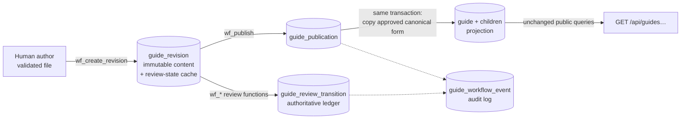
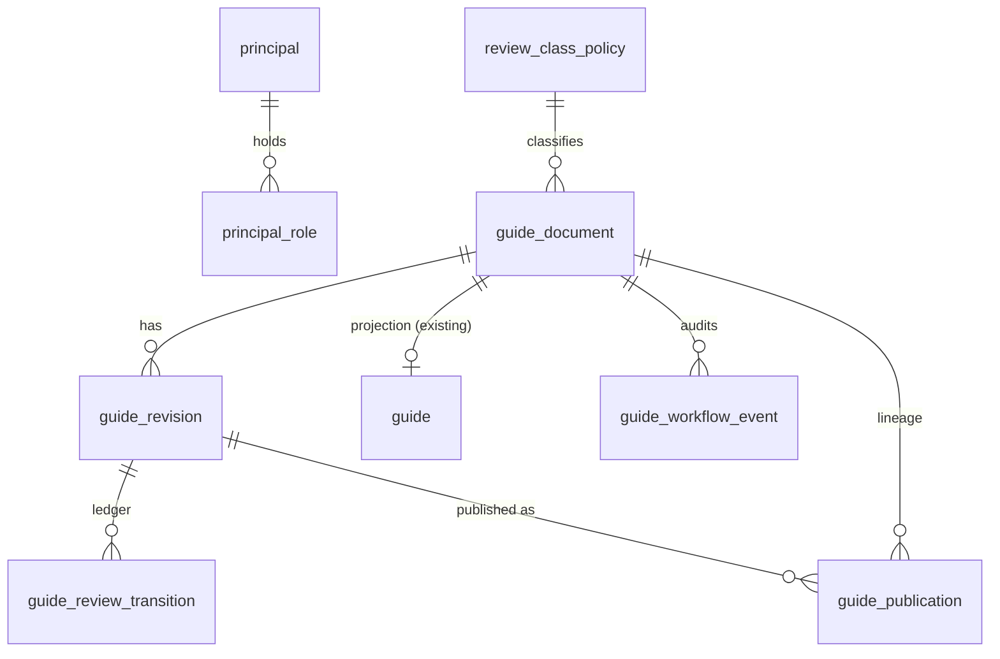

# Guide legal review and publication workflow: architecture (Issue #46)

> **Status: design proposal only (revision 2).** Nothing in this document is implemented.
> No state, table, function, command, endpoint, role or index described as *proposed*
> exists in this repository. It is not legal advice, and it doesn't claim that any workflow
> meets a legal or regulatory standard. Those judgements need qualified human review.

**Legend.** Each section marks its content as one of two kinds:

- **Existing:** verified against the code and migrations on `main` at `dfa48dd`.
- **Proposed:** design for future Issues. It does not exist yet.

**Revision 2** corrects five review findings: approval expiry, importer bypass during rollout, database identity, state consistency, and the split between the MVP and later work. The three layers and the two-digest design from revision 1 are unchanged.

## Contents

1. [Existing architecture findings](#1-existing-architecture-findings)
2. [Proposed architecture, product policy and rationale](#2-proposed-architecture-product-policy-and-rationale)
3. [Lifecycle state transition table](#3-lifecycle-state-transition-table)
4. [Roles, authentication and permissions](#4-roles-authentication-and-permissions)
5. [Digest and versioning strategy](#5-digest-and-versioning-strategy)
6. [Proposed data model and API boundaries](#6-proposed-data-model-and-api-boundaries)
7. [Publication, review-deadline and withdrawal sequences](#7-publication-review-deadline-and-withdrawal-sequences)
8. [Security invariants and failure scenarios](#8-security-invariants-and-failure-scenarios)
9. [Testing strategy](#9-testing-strategy)
10. [Phased implementation roadmap](#10-phased-implementation-roadmap)
11. [Open decisions requiring human approval](#11-open-decisions-requiring-human-approval)

**Terminology used throughout**

| Term | Meaning |
|---|---|
| **Immutable revision content** | A revision's editorial content: canonical form, review digest, slug, author, AI-assistance record, base revision, creation time. It can never be updated or deleted. A revision's lifecycle metadata (its cached review state) is *not* covered by "immutable". |
| **Review-state projection** | A mutable cache of a revision's current review state (`review_state`, `state_version`) stored on the revision row. It is derived, not authoritative. |
| **Review transition ledger** | Append-only rows recording every review transition: submit, retract, request changes, approve, revoke and confirm. This is the **authoritative** source of review state. Human reviewer decisions are the ledger rows with legal significance. |
| **Audit event log** | An append-only forensic log of every successful workflow action, including publication, withdrawal and role changes. It is not used to compute state. |
| **Publication record** | One row per time a revision went public. Its identifying columns are immutable, and its lifecycle columns (superseded, withdrawn) can be written once each and only in a forward direction. |
| **Projection** | The existing `guide` table and its child tables. They hold only live public content and are written only by workflow functions once the workflow is active. |
| **Review class** | A risk classification per category. `HIGH` means independent qualified legal review. `STANDARD` means independent human review. |

---

## 1. Existing architecture findings

All of this section describes **existing** behaviour.

### 1.1 Storage model

- **One mutable aggregate per slug.** The `guide` table (V8) has a UUID `id` and a `UNIQUE` `slug`, plus category, title, summary, Markdown `content`, `status`, `published_at` and `updated_at`. It has owned children: `guide_source` (V8, plus a nullable `editorial_key` from V9), `guide_evidence` (V9) and `guide_evidence_support` (V9), with explicit order columns and composite foreign keys.
- **No history.** An import overwrites the row in place. Earlier content, sources and evidence are not kept.
- **Two-value status.**
  - `GuideStatus` is `DRAFT` or `PUBLISHED`.
  - A database `CHECK` and `Guide.validatePublication` enforce that `DRAFT` has a null `published_at` and `PUBLISHED` needs `published_at ≤ updated_at`.
  - `Guide.publish(at)` needs a `DRAFT` and `at ≥ updatedAt`, then sets `publishedAt = updatedAt = at`.
  - `publicationIsExplicitAndDoesNotDependOnReadTime` fixes the principle that publication is an explicit act and never a function of read time.
- **Trigger precedent.** V2 and V3 already use PL/pgSQL triggers to protect evidence history and endpoint identity, so database-enforced invariants are an established pattern here.

### 1.2 Write path and identity

- **`--import-guide=<path>` (`GuideImportCommand`, an `ApplicationRunner`) is the only Guide writer.**
  - `GuideImportReader` validates the whole file before any transaction opens.
  - `GuideImporter.apply` upserts by slug in one transaction, locks an existing row (`PESSIMISTIC_WRITE`), and returns `CREATED`, `UPDATED` or `UNCHANGED`.
- **The file decides publication.** `status`, `publishedAt` and `updatedAt` come from the file, so one command can publish or return a Guide to `DRAFT`. No actor is recorded.
- **One database account for everything.**
  - `application.yml` configures one datasource (`DB_URL`, `DB_USERNAME` defaulting to `life_in_uk_app`, `DB_PASSWORD`) with Spring Boot's default connection pool.
  - There is no separate Flyway user (`spring.flyway.user` isn't set), so Flyway migrations, the web application and every command run as the **same role**. That role creates, and therefore owns, the schema.
- **Other startup runners can write.** Bootstrap runners such as `BankHolidaysBootstrap` and `NationalHighwaysBootstrap`, and replay runners, are also `ApplicationRunner`s and start with every process, including command runs.
- **No authentication or authorization.** No Spring Security, user, role or principal model exists. No HTTP write endpoint exists (`noPublicWriteMethodsExist`).

### 1.3 Read path

- **Public queries filter on status.** `GET /api/guides` and `GET /api/guides/{slug}` query only `status = PUBLISHED`. Unknown and unpublished slugs return the same 404 `GUIDE_NOT_FOUND`. Detail reads use `REPEATABLE_READ`.
- **Drafts share the table public reads use.** Their secrecy depends only on that filter.
- **No `Cache-Control` header on Guide responses.** `PlacesController` uses `no-store`, but the Guide endpoints set nothing.

### 1.4 Content digest (Issue #44, `GuideContentDigest`)

- **What it is:** a lower-case hex SHA-256 using canonicalization `guide-content-v1`, computed from a validated `GuideImportDefinition`.
- **What it covers:** slug, category, title, summary, content, **status**, **publishedAt**, **updatedAt**, ordered sources and ordered evidence with supports.
- **Absent versus empty evidence:** absent `evidence` → `null` and `evidence: []` → `[]`, so their digests differ.
- **The canonical form is itself compact JSON.** Its property order is fixed, and only `"`, `\`, control characters and unpaired surrogates are escaped.
- **Not used anywhere yet,** and it can't be recomputed from the stored rows alone, because rows can't tell `null` evidence from `[]`.

### 1.5 Content in version control

- Published artifacts live in `content/guides/<slug>-zh.json` and are validated by `ProductionGuideArtifactsTest`.
- Unpublished drafts are kept outside version control. This document doesn't reference or reproduce any of them.

### 1.6 Gaps this design closes

| Gap (existing) | Consequence |
|---|---|
| No immutable versions | Approval can't be tied to exact content |
| One shared database role that owns the schema | Any process with the credentials can do anything, including disabling triggers. Database privileges can't currently constrain the application. |
| No actor identity | Nothing can be attributed to a person |
| Importer publishes directly | Unreviewed wording can go live with one command |
| Drafts share the public table | Secrecy depends on one filter |
| No withdrawal or review-currency record | Stale or withdrawn content isn't tracked, and a re-import can silently republish |
| No cache policy | Withdrawn content can persist downstream |

---

## 2. Proposed architecture, product policy and rationale

**Everything in this section is proposed.**

### 2.1 Three layers (unchanged from revision 1)



1. **Immutable revisions.** A revision's content is the exact `guide-content-v1` canonical text and its **review digest**.
2. **Human review decisions.** They are recorded in an append-only transition ledger, against a revision and its digest.
3. **Transactional publication.** It creates a publication record and rewrites the projection from the **approved canonical form itself** in one transaction, with a separate **published digest**.

### 2.2 Where the logic lives: database functions as the trust boundary

- **Operators get no direct write access.** Workflow writes are done only by a small set of `SECURITY DEFINER` PL/pgSQL functions (`wf_*`), owned by a schema-owner role. Operators may `EXECUTE` those functions and `SELECT` workflow tables, nothing more.
- **Why in the database:** the Java command can't be the trust boundary. Anyone holding a database login could skip it with `psql`. The functions:
  - resolve the actor from the authenticated database session (§4);
  - check permissions, separation of duties, digests and state;
  - write the ledger, publication, projection and audit event together.
- **Java's role:** the Java commands parse and validate files with the existing `GuideImportReader` and `GuideContentDigest`, display canonical content and digests to humans, and call the functions. `--guide-verify` re-checks everything from Java independently (§6.6).
- **The cost:** some mapping logic (canonical JSON → projection rows) is implemented once in SQL. A differential test (§9) pins it to `GuideImporter`'s mapping.

### 2.3 Product policy (direction recorded for this design)

| Policy | Design consequence |
|---|---|
| Family & Visa content requires **independent qualified human review** before publication | Category `family-visa` is seeded as review class `HIGH`. A `HIGH` approval needs a reviewer holding `REVIEWER(HIGH)`, with a recorded qualification reference, who is not the author. |
| **No single-person exception** is automatically approved for Family & Visa | For `HIGH`: author ≠ reviewer ≠ publisher, enforced with no override flag. Any future exception would need a new, explicit policy decision and a migration. |
| **AI** may assist drafting, research and consistency checks, but **can't approve** | AI is never a principal that can hold a role. AI assistance is recorded on the revision by the responsible human author. |
| Other categories use **risk-based classification**, not mandatory legal review for everything | Review class `STANDARD` means an independent human reviewer, with qualification requirements set per category. Unclassified categories can't be published (fail closed). |
| Qualifications, reviewer availability and any regulated-advice implications need **human/legal confirmation** | These are open decisions D-2 and D-4. This design records qualification evidence but doesn't define the standard. |

### 2.4 What deliberately does not change

- **Public API:** the response contracts of `GET /api/guides` and `GET /api/guides/{slug}` are unchanged. `Cache-Control: no-store` is added.
- **Digest:** `guide-content-v1` is unchanged, and no new canonicalization is added (D-9).
- **Read-time principle:** publication and withdrawal stay explicit, audited acts. Content is never hidden by comparing read time to a deadline (§3.4, §7.3).
- **Existing published Guides** keep serving through activation unchanged (§10, MVP-8).

---

## 3. Lifecycle state transition table

**All states in this section are proposed.** They are not values of the existing `GuideStatus` enum, which stays as the projection's `DRAFT`/`PUBLISHED`.

| Kind | States | Belongs to | Authoritative source |
|---|---|---|---|
| Review state | `DRAFT`, `IN_REVIEW`, `CHANGES_REQUESTED`, `APPROVED` | a revision | `guide_review_transition` ledger. `guide_revision.review_state` is a cache. |
| Publication state | `PUBLISHED`, `SUPERSEDED`, `WITHDRAWN` | a publication record | Derived from write-once columns: `PUBLISHED` while both `superseded_at` and `withdrawn_at` are null, `SUPERSEDED` when `superseded_at` is set, `WITHDRAWN` when `withdrawn_at` is set |

A revision's **overall lifecycle** is its review state until it is first published. After that it is the state of its latest publication record.

```mermaid
stateDiagram-v2
    [*] --> DRAFT: T1 author creates revision
    DRAFT --> IN_REVIEW: T2 author submits (digest echoed)
    IN_REVIEW --> DRAFT: T3 author retracts
    IN_REVIEW --> CHANGES_REQUESTED: T4 reviewer requests changes
    IN_REVIEW --> APPROVED: T5 qualified human reviewer approves (digest echoed)
    APPROVED --> CHANGES_REQUESTED: T6 reviewer revokes (unpublished)
    APPROVED --> PUBLISHED: T7 publisher publishes within publish window
    PUBLISHED --> PUBLISHED: T12 reviewer confirms review currency
    PUBLISHED --> SUPERSEDED: T8 another revision of the slug published
    PUBLISHED --> WITHDRAWN: T10 withdraw (routine / emergency / deadline / revocation)
    SUPERSEDED --> WITHDRAWN: T11 retire
    SUPERSEDED --> PUBLISHED: T9 explicit rollback (LATER, L-2)
    CHANGES_REQUESTED --> [*]: terminal for this revision
    WITHDRAWN --> [*]: terminal; never republished
```



### 3.1 Allowed transitions

"Reviewer(C)" means a human holding `REVIEWER` for review class C of the revision's category. "Echo" means the caller passes the digest they were shown, and the function compares it with the stored one.

| # | From → To | Actor | Preconditions (all must hold) | Writes (one transaction) |
|---|---|---|---|---|
| T1 | — → `DRAFT` | Author (human) | Canonical form passes the database checks (§5.2). Category is classified. Category equals the slug's existing category. `evidence` is present, and non-empty for `HIGH` (D-10). `(slug, review_digest)` is not already used (I-11). | Revision, ledger `CREATE`, event |
| T2 | `DRAFT` → `IN_REVIEW` | Author of the revision | Echo matches. No other revision of the slug is `IN_REVIEW`. | Ledger `SUBMIT`, cache, event |
| T3 | `IN_REVIEW` → `DRAFT` | Author of the revision | Echo matches | Ledger `RETRACT`, cache, event |
| T4 | `IN_REVIEW` → `CHANGES_REQUESTED` | Reviewer(C) ≠ author | Echo matches. Reason is not blank. | Ledger `REQUEST_CHANGES`, cache, event |
| T5 | `IN_REVIEW` → `APPROVED` | Reviewer(C) ≠ author | Echo matches. Review reference, scope and `rules_as_at` recorded. | Ledger `APPROVE`, with `publish_by` and `review_due_at` computed from the class policy (§3.4). Cache, event. |
| T6 | `APPROVED` → `CHANGES_REQUESTED` | Reviewer(C) | The revision has never been published. Reason is not blank. | Ledger `REVOKE`, cache, event |
| T6b | `APPROVED` (with a `PUBLISHED` record) → `CHANGES_REQUESTED`, and that publication → `WITHDRAWN` | Reviewer(C) | Reason is not blank | Ledger `REVOKE`, withdrawal of kind `REVOCATION`, projection removed, events |
| T7 | `APPROVED` → `PUBLISHED` | Publisher ≠ author, and ≠ approving reviewer for `HIGH` | §7.1 checks. `now ≤ publish_by`. `expect-live` matches. Workflow activated. | Publication, projection, supersede (T8), events |
| T8 | `PUBLISHED` → `SUPERSEDED` | System, inside T7 (or T9) | Another revision of the slug became `PUBLISHED` in the same transaction | `superseded_at`, event |
| T9 *(later, L-2)* | `SUPERSEDED` → `PUBLISHED` | Publisher | Approval not revoked. **Review currency valid:** the revision's latest `APPROVE`/`CONFIRM` has `review_due_at > now`, otherwise a T12 confirmation is needed first. Never withdrawn. `expect-live` matches. | New publication record (new `P`, new published digest), events |
| T10 | `PUBLISHED` → `WITHDRAWN` | Publisher (`ROUTINE`); Admin (`EMERGENCY`); deadline enforcer (`DEADLINE`, §3.4); Reviewer through T6b (`REVOCATION`) | `expect-live` matches, except for `DEADLINE`, which needs the hard deadline to have passed. Reason is not blank. | `withdrawn_*`, projection removed, event |
| T11 | `SUPERSEDED` → `WITHDRAWN` | Publisher or Reviewer(C) | Reason is not blank | `withdrawn_*`, event. Rollback to it is then impossible. |
| T12 | `PUBLISHED` → `PUBLISHED` (review confirmation) | Reviewer(C) ≠ author | The revision is currently `PUBLISHED`. Echo matches. `rules_as_at` recorded. | Ledger `CONFIRM` with a new `review_due_at`, event. No content change, no new publication record, no digest change. |

### 3.2 Forbidden transitions (enforced, not just undocumented)

| Attempt | Enforcement (proposed) |
|---|---|
| Changing revision content in any state | Trigger rejects `UPDATE` of content columns and every `DELETE` (I-2) |
| Publishing anything not `APPROVED`, or after `publish_by` | `wf_publish` checks (I-1) |
| `CHANGES_REQUESTED` → anything | Terminal. The author creates a new revision. |
| `WITHDRAWN` → anything, or resubmitting identical content | Terminal, plus `UNIQUE (slug, review_digest)` (I-11) |
| Approval, confirmation or publication by the author, or by a non-human | Function checks, plus a composite foreign key restricting ledger decisions to human principals (I-5, I-6) |
| Any `HIGH` action where reviewer = publisher | Function check, with no override parameter (I-6) |
| Writing the projection or workflow tables other than through `wf_*` | Operators and the runtime role have no DML privileges (I-12, I-17) |
| `--import-guide` writing after activation, or `PUBLISHED` `HIGH` input before activation | Privileges after activation. Interim code guard before it (I-12). |
| Two revisions of one slug `IN_REVIEW`, or two `PUBLISHED` records | Partial unique indexes (I-8) |
| Stale digest echo or stale `expect-live` | Compare-and-set in the functions (I-4, I-9) |

### 3.3 Content changes during review and invalidation of approval

- **"Editing" always creates a new revision** (T1), with `based_on_revision_id` recorded. The old review must first be retracted (T3) or answered (T4), because only one revision per slug may be `IN_REVIEW`.
- **Approval names `(revision_id, review_digest)`, and revision content can't change.** So approval can never apply to other content. A new revision starts with no approval.
- **An approval stops counting for initial publication** when it is revoked (T6), when `publish_by` passes, or when the stored canonical form no longer hashes to the approved digest. The last case would be tampering, which every function call detects (I-4).

### 3.4 Approval validity, review currency and overdue content (correction 1)

Revision 1 tied a live publication's validity to an approval expiry. That was wrong: a correctly published Guide doesn't become invalid at a fixed date by itself. Four separate concepts replace it.

| Concept | Recorded on | Governs | Policy (values per class in D-3) |
|---|---|---|---|
| **Publish window** (`publish_by`) | `APPROVE` ledger row | **Initial publication (T7) only.** It stops a stale approval being used long after the reviewer checked the law. | `publish_by = approved_at + publish_window(class)`. It has no effect once published. |
| **Review currency** (`review_due_at`) | Latest `APPROVE` or `CONFIRM` row for the revision | How long published content is considered reviewed. It also controls **rollback (T9)**: an earlier revision can only be restored while its review is current. | `review_due_at = decided_at + review_interval(class)`. Extended only by a human `CONFIRM` (T12) of the same digest, with a new `rules_as_at`. |
| **Hard deadline** | Computed: `review_due_at + grace(class)` | Fail-closed limit for `HIGH` content | `HIGH`: required. `STANDARD`: none by default (D-3). |
| **Revocation and emergency withdrawal** | Ledger `REVOKE` / publication `withdrawn_*` | Immediate removal at any time | Revocation of a live revision withdraws it atomically (T6b). An Admin may withdraw in an emergency (T10). |

**What happens as a published Guide ages:**

1. **Current** (`now < review_due_at`): no action.
2. **Overdue** (`review_due_at ≤ now < hard deadline`):
   - The content **stays live**.
   - `--guide-verify` reports it, with a nonzero exit for `HIGH` (§6.6).
   - The only ways forward are a `CONFIRM` (T12), a new reviewed revision (T1→T7), or withdrawal (T10).
3. **Past hard deadline (`HIGH` only):**
   - `wf_enforce_review_deadlines()` withdraws every `HIGH` publication past its hard deadline, with withdrawal kind `DEADLINE`.
   - It can be run by any Publisher or Admin, or by the dedicated `DEADLINE_ENFORCER` service principal on a schedule.
   - It is an explicit, audited withdrawal by an identified principal. Nothing is hidden by comparing read time to a deadline, which keeps the existing explicit-publication principle (§1.1).
   - Until it runs, `--guide-verify` fails. For `HIGH` content, a missed run is therefore loudly detectable. The residual risk is a scheduler failure that also goes unnoticed (§8.1).
4. **`STANDARD` content past due:** it stays live and is reported. Whether `STANDARD` classes also get a hard deadline is part of D-3.

**Approval expiry never removes a live publication automatically.** Only an explicit, attributed withdrawal does, and for `HIGH` content that withdrawal is mandatory and automatable.

### 3.5 Competing edits and concurrent publication

- **Competing edits** become separate revisions. The single-open-review index serialises their review.
- **Every publish-type function locks the slug.** `wf_publish`, `wf_withdraw`, `wf_revoke` (on a live revision) and `wf_enforce_review_deadlines` each lock the slug's `guide_document` row (`SELECT … FOR UPDATE`).
- **Compare-and-set on the live version.** Publish and withdraw take `expect_live` (the expected current publication ID, or `none`) and fail with `STALE_LIVE_VERSION` if it differs. Deadline enforcement re-checks the deadline under the lock instead.
- **First publications can't race.** The `guide_document` row is created with the first revision, so there is always a row to lock. The partial unique index on `PUBLISHED` records is the backstop.

### 3.6 Withdrawal and replacement

- **Replacement** is T7. The previous publication becomes `SUPERSEDED` in the same transaction, so the public sees the old or the new version, never a gap or a mixture.
- **Withdrawal** (T10) deletes the projection rows for the slug (D-6), so the public API returns 404 from commit.
- **After withdrawal,** the slug can go live again only through a different, newly approved revision. Identical content can't be resubmitted (I-11).

---

## 4. Roles, authentication and permissions

**All of this section is proposed.**

### 4.1 Database roles (correction 3)

Today one role migrates, owns the schema and serves the application (§1.2). Least privilege needs separate roles first.

| Role | Login | Owns or holds | Used by |
|---|---|---|---|
| `lu_owner` | Yes, used only during deployment | Owns all tables and `wf_*` functions | Flyway only (`spring.flyway.user`/`password`, a standard Spring Boot setting with no new dependency). Credentials are held by the deployer. This is the break-glass root of trust. |
| `life_in_uk_app` (existing name) | Yes | `SELECT` on projection tables. Existing acquisition-table privileges. **No** workflow-table access. **No** projection DML after activation. **No** `EXECUTE` on `wf_*`. | Web application and acquisition jobs |
| `lu_guide_operator` | No (group role) | `SELECT` on workflow and projection tables (and on `flyway_schema_history` for validation). `EXECUTE` on `wf_*`. **No** table DML. | Granted to personal login roles |
| `op_<person>` | Yes, one per human | Member of `lu_guide_operator` | One human operator using the command line |
| `op_deadline_enforcer` | Yes | Member of `lu_guide_operator`. Mapped to a `SERVICE` principal that can only run deadline enforcement. | Scheduler (D-3) |

**`wf_*` function rules.** All `wf_*` functions are `SECURITY DEFINER`, owned by `lu_owner`, with a fixed `SET search_path = pg_catalog, <schema>`, and `PUBLIC` has no `EXECUTE`. Inside them, `current_user` is the owner, but `session_user` remains the authenticated login. That is what attribution relies on.

### 4.2 Options compared

| Option | How the CLI authenticates a human | How the database identifies the actor | Bypass resistance | Verdict |
|---|---|---|---|---|
| **O1. Shared account and a `--actor` flag** | It doesn't | It can't: the flag is whatever the caller types | None | **Rejected.** A user-supplied flag is not authentication. |
| **O2. Shared account and per-operator signed commands** (Ed25519 keys, verified in Java with JDK crypto) | The operator signs each command with a private key | Not at all. Java verifies and passes an actor ID to the database. | Weak. Anyone holding the shared database credential can write tables directly and skip Java verification. It also needs a custom signed-command format and key management. | Rejected for the MVP |
| **O3. Personal PostgreSQL logins and `SECURITY DEFINER` functions** | PostgreSQL authenticates the operator's own login (SCRAM-SHA-256 over TLS, D-5) | `session_user` inside `wf_*`, mapped to a principal through `principal.db_login` | Strong for operators: they have no table DML, and every write goes through function checks. Only the owner or superuser can bypass, and that is the documented break-glass trust boundary. | **Recommended MVP** |
| **O4. OIDC admin API and a dedicated `lu_admin_api` role** (later, L-5) | The browser authenticates against an identity provider, and the API verifies the token | The admin API's pooled connections all log in as `lu_admin_api`, so the database can't see the human. It calls `wf_*_as(actor_principal_id, …)` variants that only `lu_admin_api` may execute. | The admin API becomes a trusted component. The database records both `session_user = lu_admin_api` and the asserted principal. | Later enhancement |

**Connection pooling (O3 and O4)**

- **The long-running web application** keeps its pool on `life_in_uk_app`. That role has no `EXECUTE` on `wf_*`, so no workflow action can ever run under a shared pooled identity.
- **A CLI run is a separate short-lived process** whose datasource is the operator's own login. Every pooled connection in that process belongs to the same login, so `session_user` is constant and correct. The operator profile also sets the pool size to 1.
- **Under O4,** the per-request actor is passed as a function argument, never as session state. If session state were ever used, it would have to be `SET LOCAL`, scoped to the transaction, so it can't leak between pooled connections.

**CLI operator profile (`operator`, proposed configuration only)**

- Datasource credentials are the operator's own.
- `spring.flyway.enabled=false`, so operators never migrate.
- Web server is off. Pool size is 1.
- The bootstrap and replay runners are disabled or proven to be read-only for operators. Any write they try fails closed for lack of privilege.

**Bootstrapping the first administrator**

1. The deployer, holding `lu_owner`, creates a personal login and grants `lu_guide_operator` out of band.
2. They call `wf_bootstrap_admin(login, display_name)` **as `lu_owner`**. It succeeds only while no active `ADMIN` exists and only for `session_user = lu_owner`, and it writes an audit event.
3. After that, roles are granted only through `wf_grant_role`, which refuses self-grants (I-14).

A team therefore needs at least two humans before anyone can hold `ADMIN` together with another role (D-12).

### 4.3 Principals and role grants

- **Principal kinds:** `HUMAN` and `SERVICE`. AI is never a principal.
- **Who can hold what:**
  - `AUTHOR`, `REVIEWER`, `PUBLISHER` and `ADMIN` can only be granted to `HUMAN` principals.
  - `DEADLINE_ENFORCER` can only be granted to `SERVICE` principals.
  - This is enforced by a composite foreign key `(principal_id, principal_kind)` and a `CHECK` on role versus kind.
- **Reviewer grants are class-scoped.**
  - `REVIEWER` grants carry a `review_class`.
  - `REVIEWER(HIGH)` needs a non-blank `qualification_reference` describing the evidence of qualification. What evidence is sufficient is D-2.

### 4.4 Permissions matrix

| Action | Author | Reviewer(C) | Publisher | Admin | Deadline enforcer (service) |
|---|:-:|:-:|:-:|:-:|:-:|
| T1 create revision | ✅ human only | ❌ | ❌ | ❌ | ❌ |
| T2, T3 submit or retract | ✅ own revisions only | ❌ | ❌ | ❌ | ❌ |
| Read revisions and canonical form | ✅ | ✅ | ✅ | ✅ | ❌ |
| T4 request changes, T5 approve, T12 confirm | ❌ | ✅ not on own revision | ❌ | ❌ | ❌ |
| T6 revoke, T6b revoke a live revision (withdraws it) | ❌ | ✅ | ❌ | ❌ | ❌ |
| T7 publish | ❌ | ❌ | ✅ not own revision. For `HIGH`, not the approving reviewer. | ❌ | ❌ |
| T9 rollback *(later)* | ❌ | ❌ | ✅ same restrictions as T7 | ❌ | ❌ |
| T10 withdraw | ❌ | via T6b only | ✅ `ROUTINE` | ✅ `EMERGENCY`, reason required | ✅ `DEADLINE` for `HIGH` past hard deadline only |
| T11 retire superseded | ❌ | ✅ | ✅ | ❌ | ❌ |
| Run deadline enforcement | ❌ | ❌ | ✅ | ✅ | ✅ |
| Grant or revoke roles; register principals; classify categories (§6.1) | ❌ | ❌ | ❌ | ✅ never to self | ❌ |
| Read audit log | ✅ | ✅ | ✅ | ✅ | ❌ |
| Change or delete revision content, ledger or audit rows | ❌ | ❌ | ❌ | ❌ | ❌ |

**Separation of duties (I-6)**

| Rule | `HIGH` | `STANDARD` |
|---|---|---|
| author ≠ reviewer | Mandatory | Mandatory |
| author ≠ publisher | Mandatory | Mandatory |
| reviewer ≠ publisher | Mandatory, no exception | Recommended (D-1) |

Holding `ADMIN` never grants review or publish rights.

---

## 5. Digest and versioning strategy

**`guide-content-v1` exists and is unchanged.** How this section uses it is proposed.

### 5.1 Two definitions, two digests (unchanged from revision 1)

| Artifact | Definition | Digest |
|---|---|---|
| Review artifact (a revision) | `D_r`: `status = DRAFT`, `publishedAt = null`, `updatedAt = T_r`, evidence present | `review_digest = v1(D_r)` |
| Published artifact (a publication) | `D_p = derive(D_r, P)`: identical to `D_r` except `status = PUBLISHED`, `publishedAt = updatedAt = P` | `published_digest = v1(D_p)` |

**Derivation rule.**

- `derive` mirrors the existing `Guide.publish(at)`: it needs `P ≥ T_r`.
- `P` is the database transaction time, truncated to microseconds. A user can't supply it.
- Every other field is identical, including evidence presence (`null` versus `[]`).
- Comparisons always pair review digest with review digest, and published digest with published digest. Linking the two always goes through `derive`.

### 5.2 Content stored once, as canonical text

- **A revision stores only `canonical_form text`,** the exact v1 line, with no separate structured copy. That rules out any disagreement between "what was hashed" and "what is published".
- **`wf_create_revision` checks it in the database:**
  - `encode(sha256(convert_to(canonical_form, 'UTF8')), 'hex') = review_digest`;
  - `canonical_form::jsonb` parses;
  - `canonicalization = 'guide-content-v1'`;
  - status is `DRAFT` and `publishedAt` is null;
  - the slug and category match the document.

  Content with unpaired surrogates, which jsonb rejects, can't be stored, so it fails closed.
- **Full v1 conformance is checked in Java.** Parsing back to a `GuideImportDefinition` and requiring `v1(definition) == canonical_form` byte for byte happens in the author's CLI before creation, again in the reviewer's and publisher's CLIs before their calls, and in `--guide-verify`.
  - A malicious caller could call `wf_create_revision` directly with self-consistent but non-canonical text.
  - The reviewer's command would then refuse to show it as valid, and `--guide-verify` would fail.
  - Even so, what the reviewer approved and what gets published are the **same bytes**, because the projection is copied from the stored text.

### 5.3 Computing the published digest inside the database

- **The swap.** `wf_publish` builds the published canonical text by replacing exactly one segment:

  ```
  "status":"DRAFT","publishedAt":null,"updatedAt":"<T_r>"
  →
  "status":"PUBLISHED","publishedAt":"<P>","updatedAt":"<P>"
  ```

- **Why the replacement is safe.** v1 escapes every `"` inside string values, so an unescaped `"status":` can only be the root property. The function also asserts the segment occurs **exactly once**.
- **`P` format:** `to_char(P AT TIME ZONE 'UTC', 'YYYY-MM-DD"T"HH24:MI:SS.US"Z"')`, matching v1's six-digit format.
- **Result:** `published_digest = sha256` of that text. It is stored on the publication record, and `--guide-verify` recomputes it independently with `GuideContentDigest`.

### 5.4 Revision identity

- **`revision_id` (UUID)** is the identity used for transitions and audit. `revision_number` (per slug, increasing) is for people to read.
- **`(slug, review_digest)` is unique.** Identical content returns the existing revision as `EXISTING`, or `EXISTING_WITHDRAWN` (nonzero exit) if that revision was withdrawn.

### 5.5 Evidence presence, future versions and snapshots

- **Evidence presence (D-10):** `evidence` must be present for every revision, and non-empty for `HIGH`.
- **Future canonicalizations:** any new version is added alongside v1 as `guide-content-v2`, never by changing v1. Stored `canonicalization` values keep existing digests valid.
- **The revision is the source and evidence snapshot.** `accessedAt` stays the consultation time. Capturing copies of official pages is out of scope (D-13).

---

## 6. Proposed data model and API boundaries

**Everything in this section is proposed.** No migration exists.

### 6.1 Entities



| Table | Columns (main) | Mutability |
|---|---|---|
| `principal` | `id`, `kind` (`HUMAN`/`SERVICE`), `db_login name UNIQUE`, `display_name`, `active`, `UNIQUE (id, kind)` | Changed only through admin `wf_*` functions. Deactivate, never delete. |
| `principal_role` | `id`, `principal_id`, `principal_kind`, `role`, `review_class NULL`, `qualification_reference NULL`, `granted_by`, `granted_at`, `revoked_at NULL`, `revoked_by NULL`. `FK (principal_id, principal_kind)`. `CHECK`s on role versus kind, and on `REVIEWER` needing a class and `REVIEWER(HIGH)` needing a qualification reference. | Insert once. Revocation columns write-once. |
| `review_class_policy` | `category PK`, `review_class`, `publish_window`, `review_interval`, `grace_period NULL` (required for `HIGH`) | `family-visa = HIGH` is seeded by migration. Admin can add or tighten categories. **Downgrading a `HIGH` category needs a migration**, not a function. |
| `guide_document` | `slug PK`, `category`, `managed_since`, `legacy bool` | Insert only. It is the lock target. |
| `guide_revision` | **Immutable content:** `id`, `slug`, `revision_number`, `based_on_revision_id`, `canonicalization`, `canonical_form`, `review_digest`, `authored_by`, `ai_assisted bool`, `ai_assistance_note NULL`, `created_at`. **Review-state cache:** `review_state`, `state_version`. Unique `(slug, review_digest)`, unique `(slug, revision_number)`. | A trigger rejects any change to content columns and every `DELETE`. The cache changes only in the same transaction as a ledger insert (§6.2). |
| `guide_review_transition` | `id`, `revision_id`, `seq`, `kind` (`CREATE`/`SUBMIT`/`RETRACT`/`REQUEST_CHANGES`/`APPROVE`/`REVOKE`/`CONFIRM`), `from_state`, `to_state`, `review_digest`, `actor_id`, `actor_kind`, `review_class`, `review_reference`, `scope`, `rules_as_at`, `publish_by`, `review_due_at`, `reason`, `occurred_at`. `UNIQUE (revision_id, seq)`. `FK (actor_id, actor_kind)`. `CHECK (actor_kind = 'HUMAN')`. | Append-only (trigger) |
| `guide_publication` | **Identity:** `id`, `slug`, `revision_id NULL`, `approval_transition_id NULL`, `legacy bool`, `published_at`, `published_digest NULL`, `published_by NULL`. **Lifecycle (write-once):** `superseded_at`, `superseded_by_publication_id`, `withdrawn_at`, `withdrawn_by`, `withdrawal_kind` (`ROUTINE`/`EMERGENCY`/`DEADLINE`/`REVOCATION`), `withdrawal_reason`. `CHECK (legacy = (revision_id IS NULL) AND legacy = (approval_transition_id IS NULL) AND legacy = (published_digest IS NULL))`. | Identity immutable. Each lifecycle group can be written once, forward only (trigger). Legacy rows can only be inserted by the activation migration. |
| `guide_workflow_event` | `id bigserial`, `occurred_at DEFAULT clock_timestamp()`, `db_session_user DEFAULT session_user`, `actor_id`, `action`, `slug`, `revision_id`, `publication_id`, `review_digest`, `published_digest`, `request_id`, `detail jsonb` (identifiers, kinds and reasons only, **never content**) | Append-only (trigger) |
| `guide_workflow_activation` | Single row: `activated_at`, `activated_by_migration` | Inserted once by the activation migration (§10, MVP-8) |

### 6.2 How state stays consistent (correction 4)

**Each fact has exactly one authoritative home:**

| Fact | Authoritative source | Derived or cached |
|---|---|---|
| Revision content | `guide_revision` content columns (immutable) | — |
| Current review state | **`guide_review_transition` ledger** | `guide_revision.review_state` and `state_version` (cache) |
| Who approved what, and when it's due | Ledger `APPROVE`/`CONFIRM`/`REVOKE` rows | — |
| Publication history and state | `guide_publication` (identity plus write-once lifecycle) | Publication state (computed) |
| Live public content | Latest `PUBLISHED` publication, plus the approved canonical form | `guide` projection (rebuilt by `wf_publish`) |
| What happened, for investigators | `guide_workflow_event` | — |

**Transactional rules (enforced by the functions, backed by triggers)**

1. **Every review transition does three things in one transaction:**
   - inserts a ledger row with `seq = state_version + 1` and `from_state = review_state`;
   - updates the cache to `to_state` with `state_version = seq`;
   - inserts one audit event.

   The unique `(revision_id, seq)` makes a concurrent second transition fail.
2. **A trigger on `guide_revision`** allows a cache update only when a ledger row with that exact `seq` and `to_state` exists in the same transaction. A deferred constraint trigger checks this at commit.
3. **The projection is written only inside `wf_publish`, `wf_withdraw`, `wf_revoke` and `wf_enforce_review_deadlines`,** in the same transaction as the publication record change.
4. **Replay check.** `--guide-verify` replays every revision's ledger and confirms that the final `to_state` equals `review_state` and the row count equals `state_version` (I-15). It also confirms that:
   - the projection exists if and only if a `PUBLISHED` record exists;
   - the projection rebuilt into a definition equals `derive(D_r, P)`.

**Audit events are never used to compute state.** If an event were missing while the ledger and the cache agree, verification reports an audit gap but the state stays correct. Every successful action writes both in the same transaction, so a gap is evidence of out-of-band tampering.

### 6.3 Indexes and constraints (summary)

- **One live version per slug:** `UNIQUE (slug) WHERE superseded_at IS NULL AND withdrawn_at IS NULL` on `guide_publication`.
- **One open review per slug:** `UNIQUE (slug) WHERE review_state = 'IN_REVIEW'` on `guide_revision`.
- **Approval must match the revision.** `FK (approval_transition_id, revision_id) → guide_review_transition(id, revision_id)`. `wf_publish` checks that it's an `APPROVE` with an equal digest.
- **Lookup indexes:**
  - `guide_revision(slug, created_at DESC)`;
  - `guide_review_transition(revision_id, seq)`;
  - `guide_publication(slug, published_at DESC)`;
  - `guide_workflow_event(slug, occurred_at)`.

### 6.4 Function and service boundaries

| Database function (`SECURITY DEFINER`) | Caller roles (checked inside) |
|---|---|
| `wf_bootstrap_admin`, `wf_register_principal`, `wf_grant_role`, `wf_revoke_role`, `wf_classify_category` | `lu_owner` (bootstrap only) / Admin |
| `wf_create_revision`, `wf_submit`, `wf_retract` | Author |
| `wf_request_changes`, `wf_approve`, `wf_revoke`, `wf_confirm` | Reviewer(C) |
| `wf_publish`, `wf_withdraw` | Publisher. `wf_withdraw` also allows Admin for `EMERGENCY`. |
| `wf_enforce_review_deadlines` | Publisher, Admin, deadline enforcer |

**Java side (proposed classes)**

- `GuideWorkflowCommand`: parses CLI options, validates with `GuideImportReader` and `GuideContentDigest`, renders canonical content for review, calls functions through JDBC, and prints outcomes. It never writes tables directly.
- `GuideIntegrityCheck`: the read-only `--guide-verify`.
- `GuideQuery` and the public controller: unchanged, and with no dependency on any workflow class.

### 6.5 CLI contracts (MVP)

Each command runs under the `operator` profile as the operator's own login: one operation, one transaction, nonzero exit on failure.

| Command | Function | Outcome |
|---|---|---|
| `--guide-revision-create=<file> [--based-on=<id>] [--ai-assisted="<note>"]` | `wf_create_revision` | `CREATED <id> <reviewDigest>` / `EXISTING …` / `EXISTING_WITHDRAWN …` |
| `--guide-revision-show=<id>` | read only | Rendered canonical content plus digest, for review |
| `--guide-review-submit=<id> --expect-digest=<hex>` / `--guide-review-retract=…` | `wf_submit` / `wf_retract` | `SUBMITTED` / `RETRACTED` |
| `--guide-review-request-changes=<id> --expect-digest=<hex> --reason=…` | `wf_request_changes` | `CHANGES_REQUESTED` |
| `--guide-review-approve=<id> --expect-digest=<hex> --reference=… --scope=… --rules-as-at=YYYY-MM-DD` | `wf_approve` | `APPROVED publish_by=… review_due_at=…` |
| `--guide-review-confirm=<id> --expect-digest=<hex> --reference=… --rules-as-at=…` | `wf_confirm` | `CONFIRMED review_due_at=…` |
| `--guide-review-revoke=<id> --reason=…` | `wf_revoke` | `REVOKED` (plus `WITHDRAWN` if it was live) |
| `--guide-publish=<id> --expect-review-digest=<hex> --expect-live=<publicationId\|none>` | `wf_publish` | `PUBLISHED <publicationId> <publishedDigest>` / `ALREADY_PUBLISHED` |
| `--guide-withdraw=<slug> --expect-live=<publicationId> --reason=… [--emergency]` | `wf_withdraw` | `WITHDRAWN` |
| `--guide-enforce-review-deadlines` | `wf_enforce_review_deadlines` | List of withdrawn slugs (may be empty) |
| `--guide-verify` | read only | Report. Nonzero exit on any integrity failure or `HIGH` overdue item. |

**No command takes an actor, a publication time or a review class as input.** Those come from the session, the database clock and the policy table.

**Public API.** `GET /api/guides` and `GET /api/guides/{slug}` keep their contracts and gain `Cache-Control: no-store` (D-7). Exposing `publishedDigest` publicly is a later option (L-7). No public code path reads workflow tables, and the runtime role can't (I-3).

### 6.6 Integrity verification (`--guide-verify`, MVP)

For every slug, it checks:

- the replayed ledger equals the cache (I-15);
- `sha256(canonical_form) = review_digest`, and `v1(parse(canonical_form)) = canonical_form`;
- a projection exists **if and only if** exactly one `PUBLISHED` record exists;
- the projection rebuilds to `derive(D_r, P)`, using `D_r`'s evidence presence, and that hashes to `published_digest`;
- every non-legacy publication references an `APPROVE` by an authorised human for the same digest. Legacy publications have no revision, so for them only the projection-existence and audit checks apply;
- review currency is reported. Any `HIGH` publication past its due date is a failure.

---

## 7. Publication, review-deadline and withdrawal sequences

**All of this section is proposed.**

### 7.1 Publish (T7)

```mermaid
sequenceDiagram
    actor Pub as Publisher (op_<person> login)
    participant CLI as --guide-publish (operator profile)
    participant F as wf_publish (SECURITY DEFINER)
    participant DB as PostgreSQL (one transaction)
    Pub->>CLI: revisionId, expect-review-digest, expect-live
    CLI->>CLI: show canonical content + digest; Java re-validates v1 conformance
    CLI->>F: call
    F->>DB: activation row exists? lock guide_document FOR UPDATE
    F->>DB: actor = principal(session_user); PUBLISHER, HUMAN, active
    F->>DB: revision APPROVED (cache == ledger); latest APPROVE not revoked; now ≤ publish_by
    F->>F: digest echo == review_digest == sha256(canonical_form); separation of duties (class)
    F->>F: P = transaction time (µs); swap segment → published text; published_digest
    F->>DB: expect-live == current PUBLISHED record (or none)
    F->>DB: replace projection rows from published text (status PUBLISHED, published_at = updated_at = P)
    F->>DB: supersede previous record; insert publication; insert events
    F-->>CLI: PUBLISHED publicationId publishedDigest
```

- **Failure:** any failed check or database error rolls back everything, and the earlier version stays live.
- **Idempotency:** publishing the revision that's already `PUBLISHED` returns `ALREADY_PUBLISHED` with no writes. A retry after an unknown outcome returns either that or `STALE_LIVE_VERSION`.

### 7.2 Confirm and deadline enforcement

```mermaid
sequenceDiagram
    participant Sched as Scheduler (op_deadline_enforcer)
    participant F as wf_enforce_review_deadlines
    participant DB as PostgreSQL
    Sched->>F: run (also runnable by Publisher/Admin)
    loop each HIGH slug with a PUBLISHED record
        F->>DB: lock guide_document; recompute hard deadline from latest APPROVE/CONFIRM + policy
        alt past hard deadline
            F->>DB: delete projection; withdrawn_* (kind DEADLINE); event
        else not past
            F->>DB: no change
        end
    end
    F-->>Sched: list of withdrawn slugs
```

- **Confirmation** (T12, `wf_confirm`) is a reviewer action on the live revision. It records a new `review_due_at` and changes no content, digest or publication record.
- **Each slug is handled in its own transaction,** so one failure doesn't block the others.

### 7.3 Withdraw (T10), emergency withdrawal and revocation of a live revision

- **`wf_withdraw`:**
  1. lock the slug;
  2. check the role and withdrawal kind;
  3. check `expect-live`;
  4. delete the projection rows (public 404 from commit);
  5. set the `withdrawn_*` columns;
  6. write an event.
- **Emergency:** an Admin with `--emergency` can do this, and a reason is required.
- **`wf_revoke` on a live revision** does the same withdrawal (kind `REVOCATION`) in the same transaction as the ledger `REVOKE`.

### 7.4 Failure recovery

| Failure | Behaviour |
|---|---|
| Crash mid-transaction | Rolled back. The command is safe to re-run (§7.1). |
| `P < T_r` (clock or author error) | Publish rejected. A corrected revision is needed. |
| Deadline scheduler doesn't run | `HIGH` content past hard deadline stays live, but `--guide-verify` fails and anyone with Publisher or Admin can run enforcement (§8.1) |
| Verify finds drift | Withdraw (fail closed) or re-publish the approved revision. Never repair rows by hand. |

---

## 8. Security invariants and failure scenarios

**All invariants are proposed.** Each needs automated tests before its phase is accepted (§9).

| ID | Invariant |
|---|---|
| I-1 | **Initial publication** needs an `APPROVE` that is not revoked, made by an active human holding `REVIEWER` for the category's class, for the same revision and the same `review_digest`, with `now ≤ publish_by`. A publication without one exists only as a `legacy` row inserted by the activation migration, and none can be created afterwards. Staying live does **not** depend on approval age (§3.4). |
| I-2 | Revision content, ledger rows and audit events can't be updated or deleted. Publication identity is immutable, and lifecycle columns are write-once and forward-only. |
| I-3 | The runtime role can `SELECT` only projection tables. The projection holds only `PUBLISHED` content, so no draft, revision or ledger data can reach the public API. |
| I-4 | Every review or publish function needs the caller's echoed digest to equal `review_digest`, and `sha256(canonical_form)` recomputed in that transaction. |
| I-5 | The actor is always `principal(session_user)` (MVP) and is never taken from input. Only `HUMAN` principals hold `AUTHOR`, `REVIEWER`, `PUBLISHER` or `ADMIN`. The only `SERVICE` capability is `DEADLINE` withdrawal. AI is never a principal. |
| I-6 | Separation of duties: author ≠ reviewer and author ≠ publisher for every class; reviewer ≠ publisher for `HIGH` with no override (`STANDARD` per D-1); Admin alone grants no review or publish right. |
| I-7 | Every successful action writes exactly one audit event in its transaction. Review transitions also write exactly one ledger row. |
| I-8 | At most one `PUBLISHED` record and one `IN_REVIEW` revision per slug. |
| I-9 | Publish and withdraw need `expect-live` to match under the slug lock. |
| I-10 | `published_digest = sha256(swap(canonical_form, P))`, and the projection equals the parsed published text. Java recomputes it independently. |
| I-11 | A withdrawn revision is never published again, and identical content can't be resubmitted. |
| I-12 | **Before activation:** `--import-guide` refuses `PUBLISHED` input for any `HIGH` category (interim guard, MVP-0). **From activation:** the runtime role has no projection DML, the importer refuses to run, and the only projection writers are `wf_*` functions. No mixed mode exists. |
| I-13 | Withdrawal takes effect at commit. Guide responses carry `Cache-Control: no-store`. |
| I-14 | Role grants are audited. No self-grant. The first Admin comes only from the one-time `lu_owner` bootstrap. |
| I-15 | The cached review state always equals the replay of the ledger. |
| I-16 | A `HIGH` publication past its hard deadline is withdrawn by the enforcement function, and `--guide-verify` fails while one remains live. Approval expiry never silently removes content. |
| I-17 | `wf_*` functions are `SECURITY DEFINER` with a fixed `search_path`. `PUBLIC` has no `EXECUTE`. Operators have no table DML. |

### 8.1 Failure scenarios

| Scenario | Prevented or detected by |
|---|---|
| Author edits content after approval | The edit is a new revision without approval (I-1, I-2) |
| Reviewer approves a different digest than the one shown | Echo (I-4) |
| Operator uses `psql` to insert an approval or publication row | No table DML (I-17) |
| Operator claims to be someone else | Identity comes from their own database login (I-5) |
| Shared web-app connection used for workflow actions | Runtime role has no `EXECUTE` (§4.2) |
| AI tool attempts approval | AI isn't a principal, and ledger decisions need `HUMAN` (I-5) |
| One person reviews and publishes `HIGH` content | Function check with no override (I-6) |
| Old jar runs `--import-guide` after activation | No projection privileges, so the database denies it (I-12) |
| Someone imports a `PUBLISHED` Family & Visa file before activation | Interim guard (I-12). Residual risk: the shared credential can still write directly until MVP-8. This is why MVP-0 ships first and activation follows soon after. |
| Approval goes stale before publishing | `publish_by` (I-1) |
| Published `HIGH` content goes unreviewed for too long | Overdue reporting, `CONFIRM`, then `DEADLINE` withdrawal (I-16) |
| Scheduler for deadline enforcement silently fails | `--guide-verify` fails. Residual risk if verification isn't run either. Scheduled verification plus alerting is L-3. |
| Two publishers race | Slug lock plus `expect-live` (I-8, I-9) |
| Draft leaks through a query bug | Projection holds no drafts, and the runtime role can't read workflow tables (I-3) |
| Withdrawn content cached downstream | `no-store` (I-13) |
| Owner or superuser rewrites history | Not preventable inside the database (break-glass boundary). Detectable through verification and audit gaps. Off-host export is L-4. |
| Personal operator credential leaks | Limited to that person's roles. Every use is attributed and visible. Revoke the login and role. |

---

## 9. Testing strategy

**All of these tests are proposed.** They use the existing isolated temporary PostgreSQL, synthetic fixtures only, and no network. Tests create the proposed roles (`lu_owner`, `life_in_uk_app`, `lu_guide_operator` and several `op_*` logins) inside the temporary cluster and connect as each.

| Layer | Tests |
|---|---|
| Role separation | The runtime role can't `SELECT` workflow tables, `EXECUTE` `wf_*` or (after activation) write the projection. Operators have no table DML. `PUBLIC` has no `EXECUTE`. `search_path` is pinned. |
| Attribution | Every function records the principal of `session_user`. Arguments can't change it. An unregistered or inactive login is rejected. |
| State machine | Table-driven: each allowed transition in §3.1 succeeds, and every other (state, action, role) combination is rejected. That covers separation of duties per class, and `HIGH` reviewer = publisher rejected with no override. |
| Ledger consistency | Cache equals ledger replay after every transition. A concurrent second transition fails on `seq`. A direct cache update without a ledger row is rejected by the trigger. |
| Immutability | `UPDATE`/`DELETE` on content, ledger and audit rows fail for every role except the owner. Publication lifecycle columns can't be rewritten or reversed. |
| Digests | `sha256(canonical_form)` is checked on create. The segment swap appears exactly once, matches `GuideContentDigest` on fixed synthetic fixtures, and keeps evidence presence. `P` truncation and format are checked. |
| Projection mapping (differential) | For synthetic definitions, the projection written by `wf_publish` equals what `GuideImporter.apply(derive(D_r, P))` produces, row by row. |
| Approval validity | Publish after `publish_by` fails. A live publication stays live after `publish_by` and after `review_due_at`. `CONFIRM` extends `review_due_at` without changing content or digest. Revoking a live revision withdraws it atomically. |
| Deadlines | `HIGH` past hard deadline is withdrawn by enforcement with kind `DEADLINE`. Not-yet-due content is untouched. `STANDARD` content is never withdrawn by enforcement. The enforcer principal can do nothing else. |
| Concurrency | Two publishes race: one wins, the other gets `STALE_LIVE_VERSION`. Publish races withdraw. First publication races. |
| Failure injection | An error after the projection write rolls back everything, and the earlier version keeps serving. |
| Activation | Before activation, `wf_publish` refuses. The activation migration refuses if `DRAFT` projection rows or `HIGH`-category projection rows exist. After activation, every pre-existing published Guide's public response is byte-identical, and `--import-guide` and old-style writes fail. |
| Public API | Revisions in any state are never visible. Withdrawal gives 404 at commit. Supersede is atomic. Contracts unchanged except `Cache-Control`. |
| Verification | `--guide-verify` passes on a clean database and fails on each kind of injected drift, including a ledger/cache mismatch, a missing event, projection drift and `HIGH` overdue. |
| Disclosure | No real unpublished wording in tests or fixtures. Logs and audit `detail` contain identifiers and digests only. |

---

## 10. Phased implementation roadmap

**These are proposed future Issues and are not created yet.**

### 10.1 Activation boundary (correction 2)

- **Before activation,** production behaviour is exactly today's, apart from the interim MVP-0 guard. The new tables and functions may exist, but `wf_publish` refuses while `guide_workflow_activation` is empty.
- **Activation is one Flyway migration plus the release that contains it** (MVP-8). In one transaction it:
  1. **refuses to proceed** if any `DRAFT` row, or any row in a `HIGH` category, exists in the `guide` projection (fail closed: drafts must not become managed content implicitly, and no legacy `HIGH` content may exist);
  2. registers **every** existing slug as a managed `guide_document` (`legacy = true`) with a `legacy` `PUBLISHED` publication record, leaving the projection untouched so the public API is unchanged;
  3. revokes `INSERT`/`UPDATE`/`DELETE` on projection tables from `life_in_uk_app`;
  4. inserts the activation row.

  The same release replaces `GuideImportCommand` with a command that refuses to run.
- **After activation:**
  - every slug is managed;
  - **there are no unmanaged slugs, so there is no mixed mode**;
  - legacy content stays live and can be withdrawn, or replaced by a reviewed revision;
  - new content of any category goes live only through `wf_publish`.
- **Old binaries fail closed.** A pre-activation jar run against an activated database fails its import for lack of privileges.

### 10.2 MVP: mandatory publication safety

```mermaid
flowchart LR
    M0[MVP-0 Interim HIGH import guard] --> M1[MVP-1 Database role separation]
    M1 --> M2[MVP-2 Principals, attribution, audit log]
    M2 --> M3[MVP-3 Immutable revisions + review classes]
    M3 --> M4[MVP-4 Review ledger + human decisions]
    M4 --> M5[MVP-5 Publication function, inert]
    M5 --> M6[MVP-6 Withdrawal, revocation, deadlines, no-store, inert]
    M6 --> M7[MVP-7 Integrity verification]
    M7 --> M8[MVP-8 Atomic activation]
```



| Issue | Purpose and scope | Depends on | Acceptance criteria | Non-goals |
|---|---|---|---|---|
| **MVP-0 Interim import guard for high-risk categories** | `--import-guide` refuses `PUBLISHED` input for category `family-visa` (code-level list). Small and shipped first. | — | Unit and CLI tests: a `PUBLISHED` `family-visa` file is rejected with no writes. Other categories are unchanged. | Database enforcement (MVP-8). Any workflow. |
| **MVP-1 Database role separation** | `lu_owner` for Flyway (`spring.flyway.user`), least-privilege runtime role, `lu_guide_operator` group, `operator` CLI profile (Flyway off, pool size 1, runners safe). Deployment runbook. | MVP-0 | Isolated-Postgres tests with real roles: the runtime role can't run DDL or touch owner-only objects. The app and every existing test still pass under the split roles. | Workflow tables. OIDC. |
| **MVP-2 Principals, role grants and audit log** | `principal`, `principal_role`, `guide_workflow_event`; `wf_bootstrap_admin`, `wf_register_principal`, `wf_grant_role`, `wf_revoke_role`; `session_user` attribution; append-only triggers. | MVP-1 | Bootstrap works once only, as owner. No self-grant. Role/kind `CHECK`s hold. Events can't be changed. The actor can't be supplied as an argument. | Revisions. HTTP. |
| **MVP-3 Immutable revisions and review classes** | `review_class_policy` (seeded `family-visa = HIGH`), `guide_document`, `guide_revision`; `wf_create_revision`; `--guide-revision-create` and `--guide-revision-show`; database digest checks; Java v1 conformance. | MVP-2 | `EXISTING` and `EXISTING_WITHDRAWN` outcomes. Content immutable. Unclassified categories rejected. `HIGH` needs non-empty evidence. Not visible publicly. | Review decisions. Publication. |
| **MVP-4 Review ledger and human decisions** | `guide_review_transition`; review-state cache with ledger trigger; T2–T6 and T12 functions and CLI; class-scoped reviewers; separation of duties. | MVP-3 | Every review row of the §3.1 and §3.2 tables is tested. Cache equals ledger replay. Concurrent transitions are serialised. | Publication. Notifications. |
| **MVP-5 Transactional publication (inert)** | `guide_publication`; `wf_publish` with segment swap, published digest, projection copy, supersede, `expect-live`, `publish_by`; `--guide-publish`. Refuses until activation, and tests enable activation inside the test database. | MVP-4 | I-1, I-4, I-6, I-8, I-9 and I-10 tested. Differential projection test. Concurrency and failure-injection tests. | Rollback (L-2). Activation. |
| **MVP-6 Withdrawal, revocation, review deadlines and cache policy (inert)** | `wf_withdraw` (routine and emergency), live revocation (T6b), T11, `wf_confirm` currency, `wf_enforce_review_deadlines` and the `DEADLINE_ENFORCER` role; `Cache-Control: no-store` on Guide endpoints. | MVP-5 | 404 at commit. Withdrawn revisions are never republished. Deadline behaviour per §3.4. The enforcer can do nothing else. Headers present. | Scheduler hosting. Alerting (L-3). |
| **MVP-7 Integrity verification** | `--guide-verify` (§6.6) and a security regression suite across MVP-1 to MVP-6. | MVP-6 | Detects every kind of injected drift. Passes on a clean database. Nonzero exit for `HIGH` overdue. | Scheduled runs or alerting (L-3). |
| **MVP-8 Atomic activation** | Activation migration (§10.1), disabling `GuideImportCommand`, a post-activation `--guide-verify` in the deployment runbook. | MVP-7 | Refuses on drafts or `HIGH` legacy rows. Public responses byte-identical before and after. Old-jar import denied. Verification passes after activation. | Legacy re-review. Removing importer code (L-1). |

### 10.3 Later enhancements

| Issue | Purpose | Depends on |
|---|---|---|
| **L-1 Legacy reconciliation and cleanup** | Turn legacy publications into reviewed v1 revisions from the committed artifacts according to each category's class (`STANDARD` review), then remove `GuideImportCommand` and `GuideImporter` code paths that are no longer reachable. | MVP-8, D-4 |
| **L-2 Rollback to a superseded revision** | T9 with valid approval and review currency, plus a new publication record. | MVP-8 |
| **L-3 Scheduled verification, deadline enforcement and alerting** | Run enforcement and verification on a schedule, and alert on failures, overdue reviews and out-of-hours publishing. | MVP-8, D-3 |
| **L-4 Off-host audit export / hash chaining** | Tamper evidence beyond the database boundary. | MVP-8, D-14 |
| **L-5 Authenticated admin HTTP API** | OIDC (O4): `lu_admin_api` role, `wf_*_as` variants, same functions. | MVP-8, D-5 |
| **L-6 Admin UI with visual diffs** (frontend) | Review and publish screens that always send the displayed digest. | L-5 |
| **L-7 Optional public `publishedDigest`** | Downstream version binding. | MVP-8, D-8 |
| **L-8 Further automation** | Review reminders, bulk confirmation tooling, CI checks for artifacts against revisions. | L-3 |

---

## 11. Open decisions requiring human approval

None of these is decided by this document. Items marked **policy set** reflect the product direction in §2.3. Only their details remain open.

| ID | Decision | Recommendation / status |
|---|---|---|
| D-1 | Reviewer ≠ publisher for `STANDARD` | **`HIGH`: policy set, mandatory with no exception.** `STANDARD`: recommended, owner to confirm whether a recorded single-person exception is acceptable. |
| D-2 | Qualification standard and evidence for `REVIEWER(HIGH)`, reviewer availability, and any regulated-advice implications of Family & Visa content | Needs legal or professional confirmation. This design records a qualification reference but defines no standard and claims no compliance. |
| D-3 | `publish_window`, `review_interval` and `grace_period` per class; whether `STANDARD` has a hard deadline; whether scheduled enforcement is enabled at activation | Example only: `HIGH` publish window 30 days, review interval 90 days, grace 14 days. Scheduled enforcement on from activation for `HIGH`. |
| D-4 | Review class for each category beyond Family & Visa (Health & NHS, Money, GP, …), and the timetable for reviewing legacy content | **Family & Visa = `HIGH`: policy set.** Others: risk-based owner decision. Unclassified categories can't be published. |
| D-5 | Hosting supports per-person PostgreSQL logins (`CREATEROLE` for the deployer), SCRAM over TLS, and credential distribution. OIDC provider choice later. | Confirm against the actual hosting before MVP-1 |
| D-6 | Withdrawal deletes projection rows rather than setting `DRAFT` | Delete. History lives in revisions and publication records. |
| D-7 | Guide cache policy | `no-store` in the MVP. Revisit if a CDN is introduced. |
| D-8 | Expose `publishedDigest` publicly | Later (L-7). Optional. |
| D-9 | Add an editorial canonicalization instead of `derive` plus segment swap | No |
| D-10 | Evidence requirements per class | Present for all. Non-empty for `HIGH`. |
| D-11 | How AI assistance is recorded and what material AI tools may receive | `ai_assisted` plus a note on the revision, recorded by the human author. Tools get only what that author shares. |
| D-12 | Who is the first Admin, and what minimum team size is needed | The owner through bootstrap. A second human is needed before anyone holds `ADMIN` with another role. For `HIGH`, at least three people (author, reviewer, publisher). |
| D-13 | Capture copies of official source pages as provenance | Not now |
| D-14 | Off-host audit export and/or hash chaining | Later (L-4). Daily export recommended. |
| D-15 | Retire `--import-guide` entirely after L-1, or keep a read-only validation mode | Keep only validation (`--validate-guide`), with no writes |

---

*Prepared for Issue #46 as an architecture proposal (revision 2). All facts about existing
behaviour come from the repository code, configuration, migrations and tests on `main`
(`dfa48dd`). Nothing here is implemented, and nothing here constitutes legal approval of any
content or a claim of regulatory compliance.*
